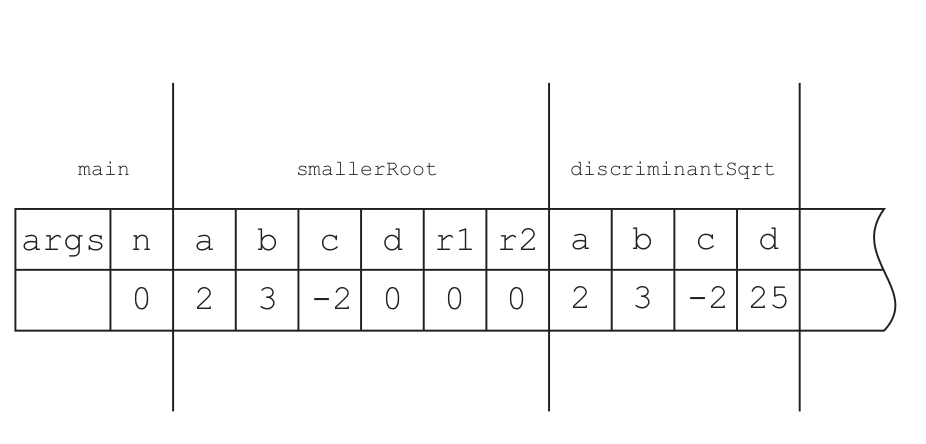

# 1. Princip funkce počítače, princip a funkce mezijazyka, vykonávání programu v Javě, alokace paměti, oblast paměti zásobník, zásobníkové rámce, oblast paměti halda

- počítač vykonává jednoduché instrukce nad daty (registry, paměť)
- data jsou řada binárních stavů - bitů (0, 1), v paměti nebo registrech (v CPU)
    - jejich význam je přiřazený pouze **konvencí**
    - **datový typ** datům přiřazuje význam a určuje možné operace, které nad nimi mohou být prováděny
- nejzákladnější instrukce, které procesor umí
    - MOV, INC, JMP, CMP,...
    - programovat pomocí těchto instrukcí může být kvůli jejich jednoduchosti poměrně obtížné => z tohoto důvodu vytvoření vyšších programovacích jazyků
- **vyšší programovací jazyky** umožňují zápis kódu bližší člověku přirozenému jazyku
    - Pascal, C, Fortran,...
    - více přirozenější OOP => Java, C#, Python
    - aby se program vykonal, musí se přeložit (zkompilovat) => **ze zdrojového kódu vzniknou instrukce pro procesor** pomocí kompilátoru
- různé procesory mají různé instrukční sady a počty registrů
- vykonání programu
    - interpretace instrukcí
        - rychlý start
        - pomalejší běh
        - "simultánní překlad"
    - Just-in-time kompilace
        - před spuštěním programu překlad do jazyka konkrétního procesoru
        - pomalejší start
        - rychlejší běh
    - mezijazyk
        - Java Bytecode => JRE
        - Intermediate Language (IL) => intermediate language
        - program spustíme na každém stroji, kde je k dispozici interpreter mezikódu
        - pozor na knihovny
        - **Java => bytecode => instrukce procesoru**
- **vykonání programu v Javě**
    - paměť: **zásobník** (Stack) a **halda** (Heap)
    - **zásobník**
        - data zde mají vždy jméno (proměnné, parametry)
        - při každém volání metody se alokuje místo pro skutečné parametry a lokální proměnné
        - při ukončení metody se místo uvolní
        - místo pro lokální referenční proměnné
        - má omezenou kapacitu, když je zanoření (volání metod) příliš hluboké, dojde k přetečení zásobníku (**stack overflow**)
        - alokování v paměti zásobníku je možné jedině deklarací lokální proměnné
        - paměť je tedy statický, lze dopředu určit, kolik se jí bude potřebovat (Java)
    - **halda**
        - data na haldě nejsou pojmenována, jen jsou referencována ze zásobníku
        - typicky většina dostupné paměti, kde jsou uloženy instance tříd
        - paměť alokována konstruktory => uvolněna, když na instanci neukazují žádné referenční proměnné ze zásobníku => automaticky pomocí **garbage collectoru**    
        - zde uložena dynamická data, jejichž velikost není při překladu předem známa

- **zásobníkové rámce:**
    - v Javě drží informace o lokálních proměnných (v metodě) a parametrech metody

