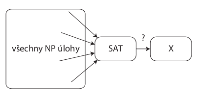
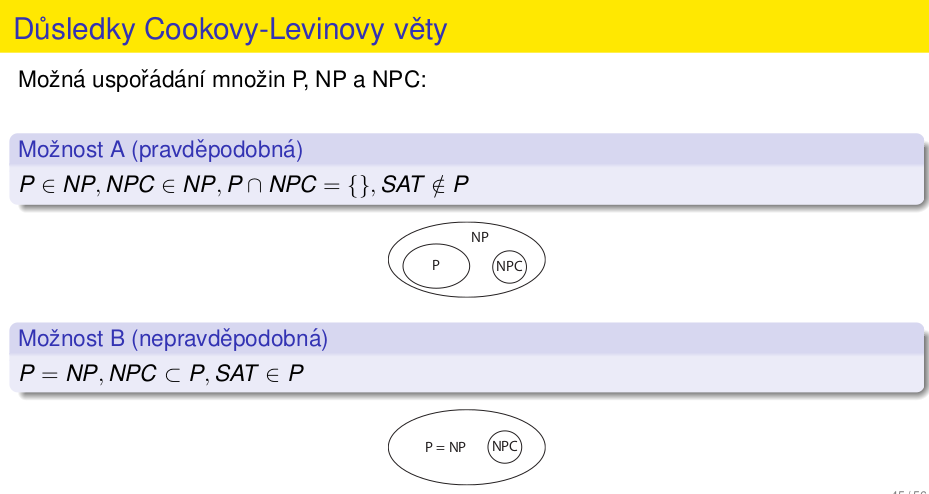

# 3. Výpočetní složitost, O-notace, Theta-notace, Omega-notace. Vypočítatelnost, složitost problémů, NP-úplnost
- při řešení úloh v oblasti informačních technologiích potřebujeme nástroj, pomocí kterého dokážeme porovnat rychlost a efektivitu vykonávání algoritmů
- jedná se o způsob klasifikace počítačových algoritmů
## O-notace
- `O(f(n))` označíme množinu všech funkcí `g(n)` takových, pro které platí, že `g(n) < c * f(n)` pro všechna `n > n0 > 0` a nějaké `c > 0`
- pokud funkce patří do `O(f(n))` pak `g(n)`:
    - "se vejde pod" `f(n)`
    - "neroste rychleji než" `f(n)`
- označuje, že to nebude výpočetně horší než `f(n)`
- příslušnost do `O(f(n))` implikuje efektivitu, pokud `f(n)` roste pomalu
- pokud `f(n)` roste rychle, neefektivita není implikována, je možné, že funkce patří do nějaké jiné `O(f(n))`
## Omega notace
- `Omega(f(n))` označíme množinu všech funkcí `g(n)` takových, pro které platí, že `g(n) > c * f(n)` pro všechna `n > n0 > 0` a pro nějaké `c > 0`
- opak O-notace
-funkce `g(n)` patří do `Omega(f(n))` když `g(n)` "roste **roste stejně rychle nebo rychleji než f(n)**"
- platí zde obrácené vztahy
    - `Om(e^n) c Om(2^n) c ... c Om(log(n)) c Om(1)`
- příslušnost do `Om(f(n))`, kde `f(n)` roste pomalu, **neimplikuje efektivitu**
- příslušnost do `Om(f(n))`, kde `f(n)` roste rychle, **implikuje neefektivitu**
## Theta notace
- Pokud `g(n) ∈ O(f(n))` a zároveň `g(n) ∈ Om(f(n))`, pak `g(n) ∈ Theta(f(n))`
- `g(n)` neroste ani rychleji ani pomaleji než `f(n)`, roste stejně rychle
- graf `g(n)` lze od jistého `n0` uzavřít mezi grafy `c1 * f(n)` a `c2 * f(n)` (**c1 < c2**)
- množiny `Theta(e^n), Theta(2^n), Theta(n^3)`, jsou **disjunktní** - žádná `g(x)` nepatří do obou současně
- příslušnost `g(n)` do `Theta(f(n))` docela dobře popisuje chování `g(n)`
- efektivita se dá seřadit podle pořadí odpovídajícíh `O(f(n))` množin
- pokud `g1(n) = 1000n` a `g2(n) = n log2(n)`, pak pro všechna realistická `n` platí `g2(n) < g1(n)`, přestože `g2(n) ∈ Theta(nlog(n))` a `g1(n) ∈ Theta(n)`

## Přehled

- `O`, `Omega` a `Theta` jsou množiny fcí, význam může být následující:
    - čas výpočtu pro jakýkoli vstup velikosti `n` 
    - čas výpočtu pro nejlepší možný vstup vstup velikosti `n` 
    - čas výpočtu pro nejhorší možný vstup vstup velikosti `n` 
    - množství paměti nutné pro vstup velikosti `n`

- mnemotechnická poznámka
    - dobré zrpávy sdělujeme v `O` notaci
        - ta věc není pomalejší než `f(x)`
    - špatné zprávy sdělujeme v `Omega` notaci
        - ta věc není rychlejší než `f(x)`
    - přesné zprávy sdělujeme v `Theta` notaci
        - nároky té věci rostou s velikostí vstpu stejně rychle jako `f(x)`

## NP-úplnost
- klasifikace problémů
    - dolní mez složitosti je poměrně těžké určit
    - pro řadu praktických úloh je znám pouze `Omega(2^n)` algoritmus
- obecně:
    - polynomiální algoritmus je považován za zvládnutelný
        - je to s otazníkem
    - složitejší algoritmy bývají považovány za nezvládnutelné
- příklad:
    - splnitelnost výrokové formule (SAT, satisfyability)
        - logické proměnné:la
        - výroková formule
        - existuje přiřazení logických hodnot proměnným tak, že výroková formule je pravdivá
        - rozhodovací problém
        - možný postup:
            - zkoušíme všechny možnosti `2^n`
            - vpokud najdeme kombinaci, ve které je výrok splněn, vracíme `true`, po vyčerpání všech možnosatí vracíme false
            - existuje lepší postup?

### Třída problémů P
- polynomiální
- rozhodovací problémy
- **pro řešení problému existuje algoritmus pracující v čase `O(n^k)`**
    - `n` je velikost vstupu
    - `k` je konstanta, nezávislá na `n`

### Třída problémů NP
- **nedeterministicky polynomiální**
- rozhodovací problémy
- **pro řešení problému existuje nedeterministický algoritmus pracující v čase `O(n^k)`**
- **pro daný prvek `b € B` příslušného obecného problému dokážeme v polynomiálním čase ověřit, zda je řešením pro daný vstup `a € A`**
- neformálně: _pokud uhádneme řešení, pak ho dokážeme "rychle" ověřit_
- velice široká třída problémů
- `P c NP`, protože deterministický algoritmus je speciální případ nedeterministického, protože deterministický algoritmus je speciální případ nedeterministického
- příklad
    - obecný problém:
        - A: množina logických formulí
        - B: množina možných přiřazení logických hodnot proměnným
        - X: pro jaké přiřazení je formule splněna?

- rozhodovací problém:
    - A' množina formulí
    - B': `{true, false}`
    - Ẍ́' je formule splnitelná

- _rozhodovací problém **je prvkem třídy NP**: pro náhodně zvolené přiřazení `b € B` v polynomiálním čase zjistíme, zda je formule pravdivá_
    - pokud ano, pak je formule splnitelná (řešení rozhodovací úlohy je `true`)
    - pokud ne, pak nevíme nic (možná pro jiné `b € B` je formule pravdivá)

### Nedeterministický polynomiální algoritmus
- "řeší" rozhodovací úlohy
- binární výstup `true`, `false` ale **jiná interpretace**
    - `true` => ano, řešení obecné úlohy existuje
    - `false` => **nevíme**
- výstup vrací po polynomiálním počtu operací
- kromě obvyklých konstrukcí umožňuje ještě nedeterministický skok
    - náhodně se provede nebo neprovede
- správný nedeterministický algoritmus
    - je-li řešením pro daný vstup `a € A` `true`, pak **musí existovat** posloupnost náhodných voleb (tzv. **certifikát**), která povede na odpověď `true`
    - je-li řešením pro daný vstup `a € A` `false`, pak **nesmí existovat** posloupnost náhodných voleb, která povede na odpověď `true`

### Cookova Levinova
- _každá NP úloha je polynomiálně převoditelná na problém splnitelnosti logické formule_

- důsledek
    - _pokud by existoval polynomiální algoritmus na SAT, pak by existoval polynomiální algoritmus na **všechny** NP problémy_
    - NP je **velmi široká** třída problémů, a nezdá se pravděpodobné, že by pro **všechny** existoval polynomiální algoritmus

### NP-úplné problémy (NP-complete, NPC)
- množina problémů, na které lze převést všechny NP problémy
- SAT je NPC (krátká formulace Cookovy-Levinovy věty)
- díky tomu le NP-úplnost dokázat snadněji
    - stačí ukázat, že SAT je převoditelná na daný NP problém X
    - tranzitivitou převoditelnosti je dokázáno, že všechny NP jsou převoditelné na X

- NPC problémy:
    - obarvitelnost grafu
    - problém disket
    - hamiltonovský graf

- NP-těžké problémy:
    - problém obchodního cestujícího
    - Knapsack problém
    - sestavení rozvrhu hodin
