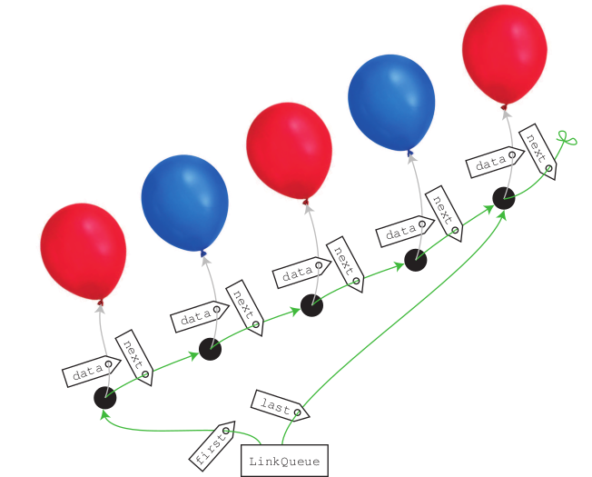
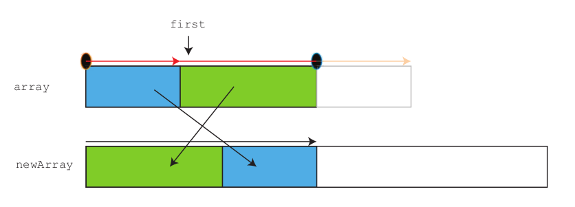

# 7. ADT Fronta, implementace spojovou strukturou, typické příklady použití

- operace:
    - přidání prvku na konec (_enqueue_)
    - vybrání prvku na začátku (_peek_)
    - odebrání prvku na začátku (_dequeue_)
- implementováno spojovou strukturou nebo polem
- implementace spojovou strukturou podobně jako u zásobníku
    
    - atributy `first` a `last`
    - pokud je fronta prázdná, reference na přidávanou položku ve `first` a `last`
    - přidání další položky:
        - vytvoření nové spojky
        - aktuální `last` nastaven `next` na novou spojku
        - do nové spojky přidána přidávaná data
        - `last` nastaven na novou spojku
            ```
            void add(<typ> e){
                Link nl = new Link();
                nl.data = e;
                if (first == null){
                    first = nl;
                    last = nl;
                }
                else{
                    last.next = nl;
                    last = nl;
                }
            }
            ```
    - vybrání prvního prvku
        ```
        <typ> get(){
            if (first!=null)
                return first.data;
            else throw new Exception();
        }
        ```
    - odebrání prvního prvku
        ```
        void removeFirst(){
            if (first!=null)
                first = first.next;
            else throw new Exception();
        }
        ```
    - časy obdobné zásobníku
    - všechny operace v čase `Theta(1)`
    - je možné, že velikost spojovacího dílku v paměti je větší než velikost samotných dat
- implementace polem
    - pro odebrání není vhodné přesouvat prvky
    - obalovací struktura si drží
        - index prvního prvku
        - počet obsazených indexů
    - postupně se uvolňuje místo na začátku pole, při přidávání prvků je možné ho využít
    - vybrání prvního prvku
        ```
        <typ> get(){
            if (count>0)
                return(array[first]);
            else throw new Exception();
        }
        ```
    - odebrání prvního prvku
        ```
        void removeFirst(){
            if (count>0){
                first = (first+1)%array.length;
                count--;
            }
            else throw new Exception();
        }
        ```
    - přidání prvku může expandovat pole, pak složitost `Theta(n)`
        ```
        void add(<typ> e){
            if (count == array.length)
                expandArray();
            array[(first + count)%array.length] = e;
            count++;
        }
        void expandArray(){
            <typ>[] newArray = new <typ>[array.length*2];
            for (int i = 0;i<array.length;i++)
                newArray[i] = array[(first + i)%array.length];
            array = newArray;
            first = 0;
        }
        ```
        
- použití při zpracovávání úkolů, událostí v pořadí v jakém přišly
