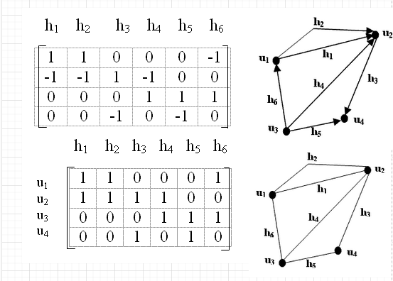
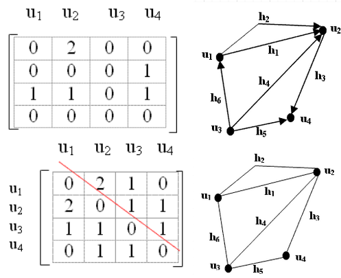
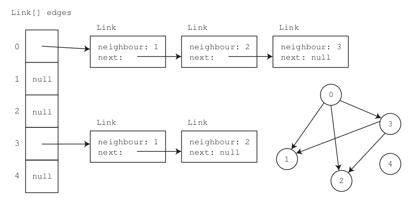
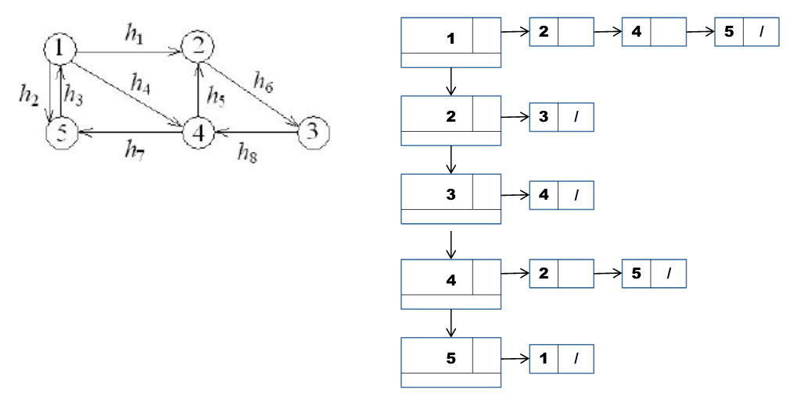

# 11. Datová struktura graf - způsob reprezentace grafů - incidenční matice, matice sousednosti, seznam sousednosti, plexová struktura, reprezentace ohodnocených grafů

## Graf
- podchycuje obecný vztah (relaci) mezi prvky
- strom je speciální druh grafu
- orientovaný graf popisuje situaci, kdy vztah **není nutně symetrický**
- definice **neorientovaného grafu**    
    - **G** je dvojice `(V, E)`
    - **V** - množina vrcholů 
    - **E** - množina hran
        - hrana je **dvouprvková množina** `{a, b}, a€V, b€V`
       
- definice **orientovaného grafu**    
    - **G** je dvojice `(V, E)`
    - **V** - množina vrcholů 
    - **E** - množina hran
        - hrana je **uspořádaná dvojice prvků** `(a, b), a€V, b€V`

- **|V|** počet vrcholů grafu
- **|E|** počet hran grafu
- _V(G)_ - množina vrcholů grafu G
- _E(G)_ - množina hran grafu G
- `y € V` je **sousedem** `x € V` právě když
    - existuje orientovaná hrana `E = (x, y)`
    - existuje neorientovaná hrana `E, x € E, y € E`
- **incidenční matice**
    - matice `|V| x |E|` popisuje vztah hran s vrcholy
    - řádky vrcholy, sloupce jednotlivé hrany
    - hodnoty:
        - `1` v daném vrcholu hrana začíná (**orientovaný graf**)
        - `-1` v daném vrcholu hrana končí
        - `2` smyčka
        - `0` v ostatních případech (**orientovaný graf**)

- **matice sousednosti**
    - pro **orientovaný graf** matice `|V| x |V|` obsahuje na pozici `[i, j]`
         hodnotu `1` pokud z *i*-tého vrcholu vede hrana do *j*-tého
         hodnotu `0` v ostatních případech
    - pro **neorientovaný graf** matice `|V| x |V|` obsahuje na pozici `[i, j]` a `[j, i]`
         hodnotu `1` pokud z *i*-tého vrcholu vede hrana do *j*-tého
         hodnotu `0` v ostatních případech
    - reprezentace, 2D pole integerů, bytů, bitů...

- **seznam sousedů**
    - sousedé každého vrcholu jsou uloženi v seznamu
    - reference na první prvek každého seznamu v poli o velikosti `|V|`
 

- **plexová struktura**
    - obdoba seznamu sousedů, s tím rozdílem, že prvek každého seznamu není uložen ve statickém poli, ale v dynamickém spojovém seznamu

- **porovnání implementací**
    - **paměťová složitost**
        - seznamem => `O(|V| + |E|)`
        - matice => `Omega(|V|^2)`
    - **sousedi vrcholu**
        - seznamem => `Omega(n)`, kde `n` je počet vrcholů
        - matice => `Omega(|V|)`
    - **test sousednosti**
        - seznamem => `Omega(n)`, kde `n` je počet vrcholů
        - matice => `O(1)`

- **ohodnocený graf**
    - **spojový seznam**
        - každé hraně (spojce listu) je přiřazeno navíc číslo nebo nějaká metrika
            - délka cesty, propustnost potrubí
    - **maticí sousednosti**
        - matice reprezentována jako `double[][]`
        - v matici na pozici vrcholů uloženo ohodnocení
        - na ostatních pozicích hodnota **mimo rozsah možných ohodnocení**
        - detaily implementace dle aplikace

