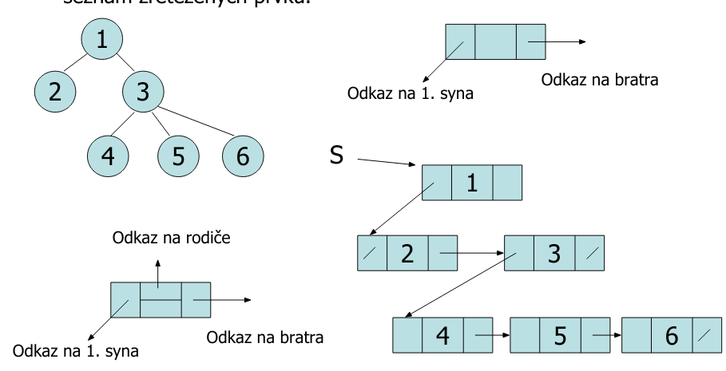
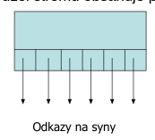
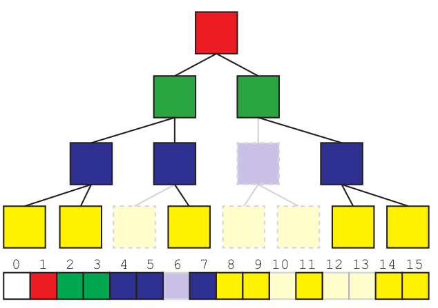

# 13. Datová struktura strom - reprezentace stromu: dynamická, n-ární, binární strom; statická implementace polem u binárních stromů implementace spojovou strukturou

## Strom
- podchycuje **vztahy** mezi prvky
    - rodokmen
    - struktura velení ve firmě (nadřízený/podřízený)
    - aritmetický výraz
    - popis trasován paprsku
- struktura s hierarchií
- větvení pouze jedním směrem
- **základní pojmy**
    - **vrchol** (node)
        - prvek struktury
        - může obsahovat další data
        - má žádného nebo jednoho předka
        - má žádného nebo více potomků
    - **hrana** (edge)
        - vztah dvou vrcholů (předek/potomek, nikdy mezi "sourozenci")
    - **kořen** (root)
        - jedný vrchol ve stromu, který nemá předka
- pravidla
    1. prázdná množina vrcholů je strom, kořenem je prázdná množina
    2. Jediný vrchol *x* je strom, kořenem je *x*
    3. je-li *x* vrchol a *T1, T2, ..., Tn* stromy s kořeny *R1, R2, ..., Rn*, pak *x* propojený hranou s každým kořenem *R1, ..., Rn* je strom a jeho kořen je *x*
- ve stromě **neexistují cykly** (uzavřené posloupnosti hran)
    - když neexistují cykly, pak lze strukturu popsat jako strom ("zavěsit" za nějaký kořen)
- pojmy:
    - list
        - vrchol bez potomků
    - vnitřní vrchol
        - vrchol, který není list
    - cesta
        - posloupnost vrcholů, ve které jsou každé dva po sobě následující vrcholy spojeny hranou
    - délka cesty
        - počet hran cesty
- ke každému vrcholu vede z kořene právě jedna cesta
    - hloubka vrcholu
        - délka cesty z kořene do vrcholu
        . hloubka kořene = 0
    - výška stromu
        - maximální hloubka vrcholu ve stromě
- **ADT Strom**
    - vybrání kořene stromu
    - přidání potomka danému vrcholu
    - vybrání předka daného vrcholu
    - vybrání potomků daného vrcholu
    - odebrání daného vrcholu ze stromu
    - operace se můžou lišit podle typu stromu (binární, uspořádaný)
 typy stromů
    - **uspořádaný strom**
        - potomci vrcholu mají jednoznačné definované, neměnné pořadí
            - děti v rodokmenu seřazené podle věku
            - argumenty ve výrazu
            - rodiče: matka první, otec druhý
    - **neuspořádaný strom**
        - potomci tvoří množinu v matematickém smyslu
            - podřízení nadřízeného v hieararchii firmy
    - **binární strom**
        - prázdná množina je binární strom
        - vrchol s uspořádanou dvojící potomků, z nichž každý je binární strom, je binární strom
    - **obecný, dynamický strom**
        - vnitřní uzly stromu mohou mít libovolný počet následníků
        - implementováno jako dynamická struktura - seznam zřetězených prvků

        
    - **n-ární strom**
        - vnitřní uzly stromů obsaují maximálně **n** následníků
        - implementace jako seznam zřetězených prvků, kde každý uzel stromu obsahuje pole ukazatelů na následníky
        
    - **implementace binárního stromu polem**

        
 
        - kořen má index *1*
        - potomci vrcholu s indexem *i* mají přiřazeny indexy *(2i)* a *(2i + 1)*
        - potom předek vrcholu s indexem *x* leží na indexu *x/2*
        - strom o hloubce *h* má vrcholy s maximálním indexem *2^(h+1) - 1*
        - vrchol je reprezentovýn svým indexem
        - vrcholu musí být přiřazena **data**, která jsou uložena v poli
            - podle dat se určí, zda je vrchol přítomen
        - data přiřazená vrcholu
            - uložená do pole na index příslušející vrcholu
            - index 0 je neobsazený (zjednodušuje to vztahy)
            - primitivní datový typ
                - nutné určit hodnotu reprezentující nepřítomnost vrcholu
            - reference na instanci třídy
                - reference `null` představuje nepřítomnost vrcholu
        - **výhody**
            - základní operace => základní aritmetické operace
        - **nevýhody**
            - musíme znát předem počet prvků nebo alespoň hloubku
                - lze řešit dynamickým zvětšováním
            - alokuje se paměť i pro nepřítomné prvky
                - alespoň paměť pro referenci
        - **úplný binární strom**
            - pro určitý index *k* platí
                - všechny vrcholy s indexem menší než *k* ve stromě existují
                - všechny vrcholy s indexem *k* a větším ve stromě neexistují
            - pro úplný binární strom je reprezentace polem vhodná
                - je možné strom zvětšovat jako dynamické pole
                - stejná analýza složitosti vložení jako u dyn. pole: průměrný počet pro vložení jenoho prvku patří do `O(1)`
    - **implementace spojovou strukturou**

        ```
        class Node{
            public <typ> data;
            public Node left, right;   
        }
        ```

        - hrany reprezentovány referenčními proměnnými `left` a `right`         
        - řeší reprezentací nepřítomného prvku
        - umožňuje přítomnost prvku s `null` daty
        - paměťově úspornější pro **řídce** zaplněné stromy
        - není třeba předem znát počet prvků
       
