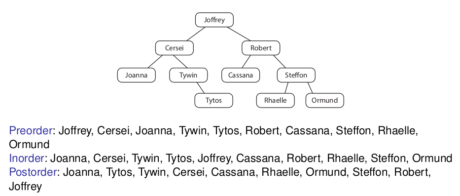
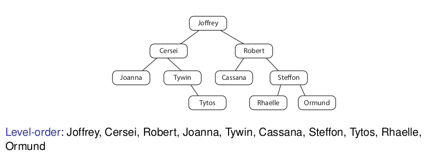

# 14. Datová struktura strom - základní algoritmy průchodu stromem: preorder, inorder, postorder - typické příklady použití

## Preorder
- zpracuje vrchol, pak levého a pak pravého potomka

```
void preorder(Node n) {
    if (n != null) {
        process(n);
        preorder(n.left);
        preorder(n.right);
    }
}

void preorder_nonrecursive(Node root) {
    Stack s = new Stack();
    s.push(root);
    while (!s.empty()) {
        Node n = s.pop();
        n.process();
        if (n.right != null)
            s.push(n.right);
        if (n.left != null)
            s.push(n.left);
    }   
}
```

## Inorder
- zpracuje levého potomka, pak vrchol, a nakonec pravého potomka

```
void inorder(Node n) {
    if (n != null) {
        inorder(n.left);
        process(n);
        inorder(n.right);
    }
}

void inorder_nonrecursive(Node root) {
    Stack s = new Stack();
    s.push(new Task(0, root);
    while (!s.empty()) {
        Task t = s.pop();
        if (t.type == 0) {
            s.push(new Task(0, t.node.right));
            s.push(new Task(1, t.node));
            s.push(new Task(0, t.node.left));
        } else {
            t.node.process();
        }
    }
}
```
## Postorder
- zpracuje levého potomka, pak pravého a nakonec vrchol

```
void postorder(Node n) {
    if (n != null) {
        postorder(n.left);
        postorder(n.right);
        process(n);
    }
}

void postorder_nonrecursive(Node root) {
    Stack s = new Stack();
    s.push(new Task(0, root));
    while (!s.empty()) {
        Task t = s.pop();
        if (t.type == 0) {
            s.push(new Task(1, t.node));
            s.push(new Task(0, t.node.right));
            s.push(new Task(0, t.node.left));
        } else {
            t.node.process();    
        }
    }
}
```



- implementace
    - přirozené použití rekurze
    - předpokládáme nějakou obecnou metodu `process(Node n)`
    - průchod zahajujeme voláním metody `preorder/inorder/postorder` nad kořenem

# Zpracování po úrovních

- rekurzivní implementace obtížná
- jednoduchá implementace pomocí frony


```
void levelOrder(Node root) {
    Queue q = new Queue();
    q.queue(root);    
    while (!q.isEmpty()) {
        Node n = q.dequeue();
        if (n.left != null) {
            q.queue(n.left);
        }
        if (n.right != null) {
            q.queue(n.right)
        }
        n.process();
    }
}
```

# Aplikace
- inorder
    - využíváno v Binary Search Tree stromech 
- preorder
    - prefixová notace
    ```
    5 - (6 + 7)
    - 5 + 6 7
    ```
- postfix
    - postfixová notace
    ```
    5 + ((1 + 2) * 4) − 3
    5 1 2 + 4 * + 3 −
    ```
    - uvolňování paměti
        - nejdřív zpracuji oba potomky, až pak můžu uvolnit paměť prvku
