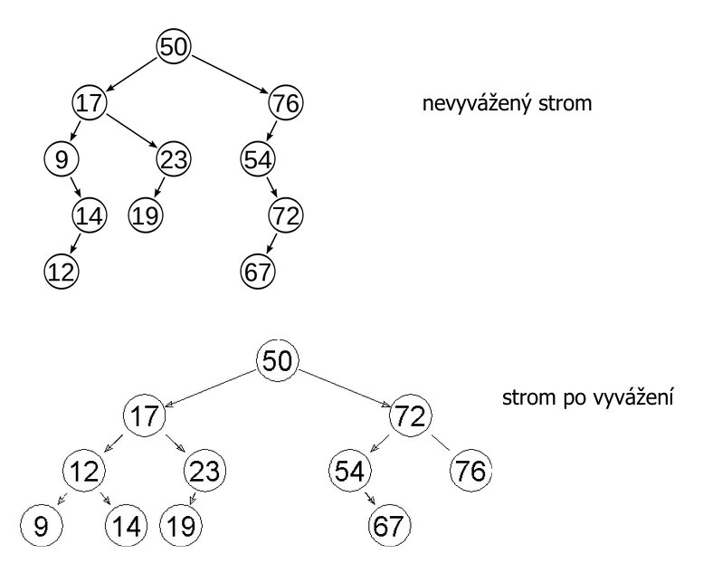
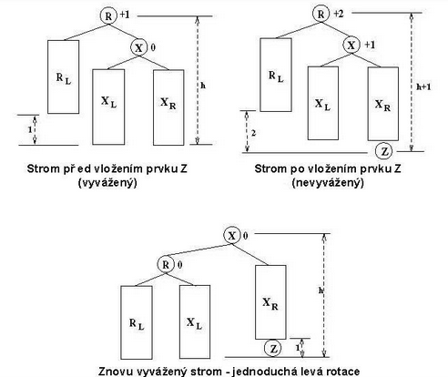
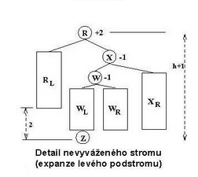
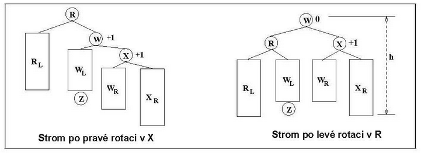

# 15. Vyhledávací stromy - BVS, AVL, B strom, vlastnosti, kdy se používají, základní způsoby vyvažování u AVL a B stromů

## BVS - Binární vyhledávací strom
- reprezentuje **uspořádanou** množinu prvků
- strom je pouze implementací, ADT samotný není hierarchický
- prvky seřazené podle klíče (nejjednodušejí `int`)
- rozhraní
    - vložení prvku s klíčem
    - odebrání prvku s klíčem
    - zjištění zda ADT obsahuje prvek s daným klíčem
    - nalezení minimálního/maximálního klíče v ADT
    - nalezení minimální/maximální hodnoty v ADT
    - vybrání všech prvků v pořadí klíčů
- složitost pro alternativní implementace:
    - seřazené pole
        - hledání: `O(log(n))` (půlení intervalu)
        - vložení: `Omega(n)`
        - odebrání: `Omega(n)`
        - min/max: `O(1)`
        - vypsání všech: `O(n)`
    - seznam
         - hledání: `Omega(n)+` (půlení intervalu)
        - vložení: `Omega(n)`
        - odebrání: `Omega(n)`
        - min/max: `O(1)`
        - vypsání všech: `O(n)`
- implementace
    - binární strom
    - každému vrcholu je přiřazena hodnota - klíče
    - klíče lze porovnávat (větší/menší)
    - složitost operací:
        - _h_ => **výška stromu**
        - složitost hledání, vkládání a odstraňování je `O(h)` v nejhorším případě
        - **degenerovaný strom**
            - může vzniknout, pokud přidáváme již seřazenou posloupnost
            - `h = N - 1`
            - složitosti jsou `Omega(n)`
        - **úplný strom**
            - `g = ceil(log2(n)`
            - složitosti jsou `O(log(n))`
- definující vlastnost
    - je-li *x* klíč uzlu `n`, pak
        - klíče uzlu `n.left` a jeho potomků jsou menší než *x*
        - klíče uzlu `n.right` a jeho potomků jsou větší než *x*
        - předpoklad, že žádné dva klíče v ADT nejsou stejné

# AVL
- binární vyhledávací strom takový, že pro každý jeho vrchol *v* platí:
    - buď je *v* koncový
    - nebo *v* má jediného následníka, kterým je koncový vrchol
    - nebo *v* má dva následníky s výškami *hi* a *hr*, které vyhovují podmínce vyváženosti *|hi - hr| < 2*
- **ALV strom je výškově vyvážený binární vyhledávací strom, pro který platí, že pro libovolný vnitřní uzel stromu se výška levého a pravého syna liší nejvýše o 1**

- vyváženost AVL stromu se kontroluje pokaždé operaci vložení a zrušení prvku
    - v případě, že je vyváženost porušena, provádí opětovné vyvážení pomocí jedné popř. několika rotací v jednotlivých částech stromu
- implementace je obdobná jako u BVS, datová struktura pro uzel stromu je doplněna o celočíselnou proměnnou *c(v)*, reprezentující stupeň vyváženosti uzlu, který může nabývat následujících hodnot:
    - 0, stejně vysoké
    - 1, pravý podstrom je o 1 vyšší
    - 2, pravý podstrom je o 2 vyšší
    - -1 - levý podstrom je o 1 vyšší
    - -2 - levý podstrom je o 2 vyšší
- rotace je operace, kterou se obnovuje vyváženost stromu
- provádí se přeskupením pointerů ve stromové struktuře
    - konstantní složitost `O(k)`
    - jednoduchá pravá (levá) - používáme pokud vyvažujeme přímou větev, jsou li znaménka stupně vyváženosti stejná
    
    - dvojitá pravá (levá) - používá se tehdy, pokud nejde použít jednoduchá rotace - vyvažujeme-li "zalomenou" větev
    
    - ukázka vyvážení stromu
    
    
    

# B-stromy
- vyvážený strom, který je optimalizován pro případ, kdy je část stromu, případně celý strom, uložen na vnější paměti
- vzhledem k tomu, že přístup na diskovou paměť je časově náročný, B-strom je navržen tak, aby optimalizoval (a minimalizoval) počet přístupů do vnější paměti
- B-strom řádu *m* je strom, kde každý uzel má maximálně *m* následníků a platí v něm:
    - počet klíčů v každém vnitřním uzlu je o 1 menší než počet následníků
    - všechny listy jsou na stejné úrovni
    - všechny uzly kromě kořene mají nejméně `ceil(m/2)` následníků
    - žádný uzel neobsahuje více než *m* následníků (max `m-1` klíču)
- **vložení prvku**
    - nový prvek se vždy vkládá do listové stránky, ve stránce se klíče řadí podle velikosti
    - pokud dojde k přeplnění listové stránky, stránka se rozdělí na dvě a prostřední klíč se přesune do nadřazené stránky (pokud nadřazená stránka neexistuje, tak se vytvoří)
    - pokud dojde k přeplnění nadřazené stránky, předchozí postup se opakuje dokud nedojde k zařazení nebo k vytvoření nového kořene
    - analýza
        - výška *h* a řád *m*
        - maximální počet položek je `m^(h+1) - 1`
            - `m=5, h=2, 5^3 - 1 = 124`
## Využití

- **B-tree**
    - využití v databázích a souborových systémech
    - optimalizace vyhledávání, multilevel indexing 
- **BVT**
    - ideový základ pro konstrukci složitějších vyhledávacích datových struktur, konkrétně pro složené klíče a dotazy s částečně zadanými klíči.
