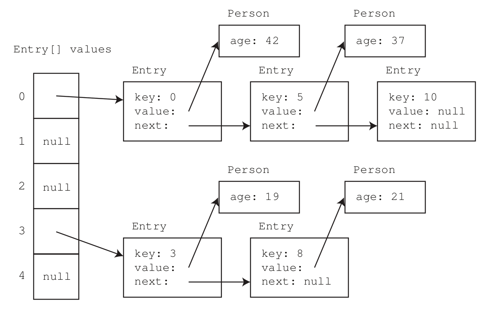

# 16. Tabulka s přímým adresováním. Rozptylové (hash) tabulky - implementace, vlastnosti a příklady rozptylovací funkce pro číselný a textový klíč, způsob řešení kolizí v rozptylových tabulkách. [KIV/PT, KIV/PPA2]

## Tabulka s přímým adresováním
- `k -> Ak` je prosté zobrazení, každá položka tabulky má své místo jednoznačně určené hodnotou *Ak* přímo odvozenou z *k*
- např. telefonní síť (klíčem je telefonníčíslo), telefonní seznam (klíčem je jméno)
- klíč typu `int`
- libovolná hodnota, např `double`
- klíče jsou jen v rozsahu `0..K`, `K` je "přiměřené"
- implementace
    - pole velikosti `K+1`
    - implementace všech operací je triviální
- absence prvku v tabulce
    - závisí na aplikaci
    - `NaN` pro `double`
    - `-1` pro přirozený čísla
    - `null` pro reference
    - obecně: *vytvoření obalovací třídy*
        ```
        class Element {
            public <ValueType> value;
        }
        ```
        - implementace obsahuje pole referencí na instance `Element`
        - `null` v poli indikuje absenci hodnoty pro daný klíč
        - je-li `<ValueType` např. reference, pak můžeme danému nějakému klí či přiřadit hodnotu `null`, jinému klíči nepřiřadit nic, a tyto dva případy rozlišit
- problémy
    - často neznáme rozsah možných klíčů
    - rozsah nemusí být vůbec omezený
    - počet přípustných klíčů může být významně větší než počet prvků v tabulce: paměťová neefektivita
    - neřeši složitější klíče (klíč = množina celých čísel apod.)
- splňuje požadavky na třídu složitosti
    - až na `getKeys()`, která má složitost `Omega(K)`

## Rozptylové (hash) tabulky
- využití rozptylové (hash) funkce `H(k)`
    - vstup: klíč *k*
    - výstup: index v poli _i_
- vlastnosti rozptylové funkce
    - hodnota nesmí přesáhnout délku pole
    - pro různé klíče by měla dávat různé hodnoty
        - nelze vždy, protože počet možných klíčů může být významně větší než délka pole
- rovnost hodnoty rozptylové funkce pro různé klíče: **kolize**
- použití rozptylové funkce:
    - vložení hodnoty pro klíč *k*
        - hodnota se vloží na index *H(k)*
    - získání hodnoty pro klíč *k*
        - hodnota získána na indexu *H(k)*
    - zrušení přiřazení klíče *k*
        - na index *H(k)* se uloží `null`
- kolize rozptylové funkce
    - vznik
        - do ADT je vložena hodnota s klíčem *k1*
        - v implementace je použita pozice v poli na indexu *i1 = H(k1)*
        - do ADT je vkládána hodnota s klíčem *k2* takovým, že *H(k2) = H(k1)*
        - pozice v poli je již obsazena
    - řešení
        - v poli jsou uloženy **spojové struktury**
        - každý záznam ve struktuře obsahuje klíč a hodnotu
        - podobně jako kartotéka
        
        - přidání prvku
            - vložíme prvek na začátek spojové struktury (konstantní čas přidání)
        - získání/odebrání prvku
            - musím postupně projít celý seznam, abych našel položku, kterou hledám
            - složitost => délka spojové strukutry je *n/m*, složitost tedy `Omega(n/m) = Omega(n)`
            - zlepšení složitosti, omezení poměru *n/m* (limit)
            - při přepřekročení limitu přesuneme data do větší struktury, např. zdvojnásobíme *m*
            - složitost výběru je tedy s využitím optimalizace `Omega(n/m) = Omega(1)`
- hash funkci je možné realizovat následujícími způsoby:
    - *i* je částí *k*
    - *i* je částí operace nad *k*
    - *i* je zbytkem po dělení rozsahem tabulky *p*
    - *i* je zbytkem po dělení *N*, *N* je nejbližší menší
- příklady rozptylových funkcí
    - modulární metoda pro text
        - hodnoty v nějakém obecném rozsahu => operace modulo
        - klíčem je několik přirozených čísel *a0, a1,..., an*
        - požadujeme výsledek v intervalu *0..m-1*
        - _k = a0 * a1 * a2 * ... * an_
        - _h = k mod m_
        - problém přetečení => budeme rovnou modulovat
        - **některé indexy rozptylová funkce nikdy nedává**
            - např *a0, a1* v rozsahu 0..9
            - počet kobinací 100
            - nejnižší možné *k*: 0, nejvyšší možné *k*: 81 
            - `k=73..80` nikdy nenastává
    - modulární metoda pro text s rozsahem
        - rozsah položek klíče *s*
        - _k = A0 * s^0 + a1 * s^1 + ... + an * s^n_
        - _h = k mod m_
        - rozsah *k* je o něco větší
        - rozptylová funkce generuje **všechny** možné indexy
        - pokud *s* (rozsah položek klíče) a *m* (rozsah indexů pole) jsou stejné, pak záleží jen na porvní položce klíče
            - podobný efekt, pokud je *m* dělitelné *s*
        - řešení => *m* jako **prvočíslo**
