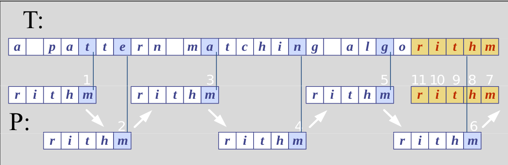

# 17. Algoritmy vyhledávání podřetězce v řetězci: hrubá síla, Boyes-Moore, KMP, Rabin-Karp - principy a vlastnosti algoritmů
- definice:
    - _pro daný textový řětězec T a vzorový řetězec P, hledáme vzor P uvnitř textu_
        - T: _the rain in spain stays mainly on the plain_
        - P: _n th

## Brute force
- pro každou pozici v textu *T* kontrolujeme, zda v ní nezačíná vzor *P*
- nejhorší případ je `O(mn)`
- rychlý pro velké abecedy
- pomalý pro malé abecedy
- špatný případ:
    - T: *aaaaaaaaaaaaaaaaaaaaaah*
    - P: *aaah*

## Boyer-moore
- zalořen na
    - zrcadlovém přístupu k vyhledávání
       - hledáme *P* v *T* tak, že začínáme na konci *P* a postupujeme zpět k začátku
    - přeskočením skupiny znaků, které se neshodují
        - tento případ se řeší v okamžiku kdy `P[j] != T[i]`

### Případy  
1. **případ**
    - pokud _P_ obsahuje _x_, pak zkusíme posunout _P_ doprava tak, aby se poslední výskyt _x_ dostal proti _x_ obsaženému v _T[i]_
    
2. **případ**
    - _P_ obsahuje _x_, ale posun doprava na poslední výskyt _x_ není možný, pak posuneme _P_ doprava o jeden znak k _T[i+1]_
    
3. **případ**
    - pokud není možné použít případ _1_ a _2_, pak posuneme _P_ tak, aby bylo _P[0]_ zarovnáno s _T[i+1]_
    

### Příklady

- s využitím funkce `Last()`

### Funkce `Last()`
- BM algoritmus předzpracovává vzor _P_ a pro danou abecedu _A_ definuje funkci `Last()`
    - `Last()` zobrazuje všechny znaky abecedy _A_ do množiny celých čísel
- `Last(x)` je definována jako:
    - největší index _i_ pro který platí, že _P[i] == x_, nebo
    - _-1_ pokud žádný takový index v _P_ neexistuje

## KMP algoritmus
- Knuth-Morris-Pratt algoritmus vyhledává vzor v textu **zleva doprava** (jako _bruteforce_)
- posun vzoru je řešen mnohem inteligentněji než v brute force algoritmu
- pokud se vyskytne neshoda mezi textem a vzorem _P_ v _P[j]_, jaký je _největší možný posun_ vzoru, abychom se vyhnuli zbytečnému porovnávání?

### Chybová funkce

- KMP předzpracovává vzor, abychom nalezli shodu prefixů vzoru se sebou samým
- *k* je pozice před neshodou (*j-1*)
- **chybová funkce** je definována jako nejdelší prefix _P[0..k]_, který je také suffixem _P[1..k]_

- v programu je `F()` implementována jako pole (popř. tabulka)

### Výhody
- běží v optimálním čase `O(m+n)`
- algoritmus se nikdy nevrací zpět
    - proto je tedy velmi vhodný pro zpracování velkých souborů

## Rabin-Karp algoritmus
- základní myšlenka:
    - kontrolní součet pro vzor _P_ (délky _m_)
    - kontrolní součet pro každý podřetězec řetězce _T_ délky _m_
    - procházet řetězcem _T_ a porovnat kontrolní součet každého podřetězce s kontrolním součtem vzoru. Pokud dojde ke shodě vzoru provést test znak po znaku

- čas běhu je v nejhorším případě `O(m(n-m+1))`
- dle pravděpodobnostní analýzy je předpokládaný čas algoritmu `O(n+m(v+n/q))`
    - kde _v_ je správný počet posuvů
- pokud zvolíme _q >= m_ a očekávaný počet posuvů je malý, je předpokládaná doba RK algoritmu `O(n+m)`

