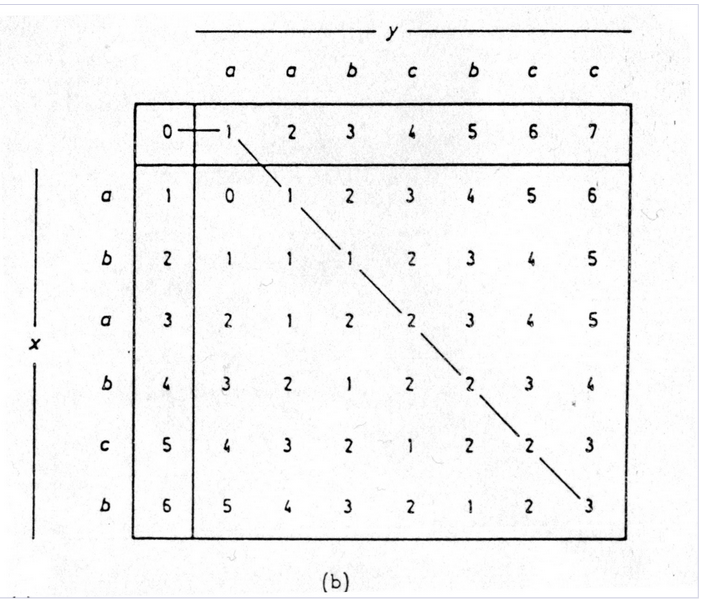
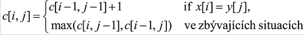
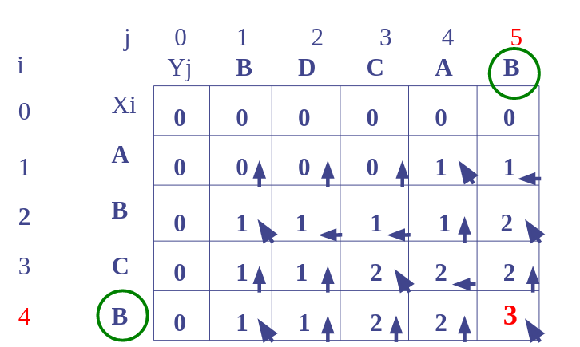
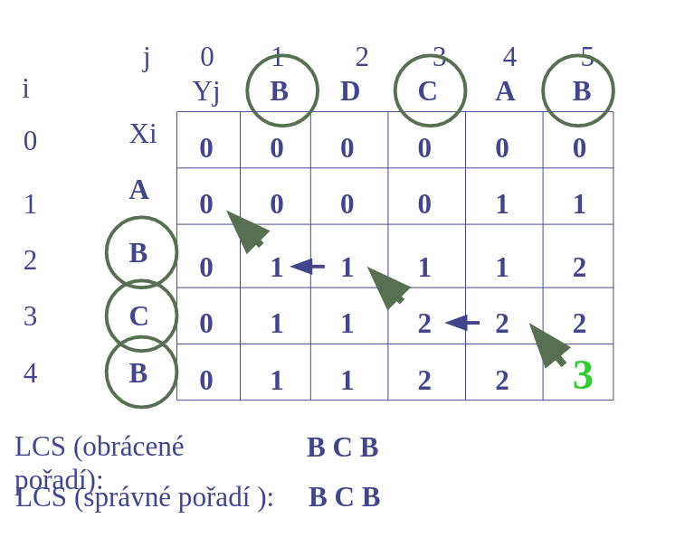
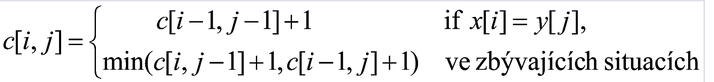

# 18. Vzájemné prohledávání řetězců - metriky pro porovnávání řetězců, výpočet edit distance, algoritmus LCS (nejdelší společná podsekvence), SCS (nejkratší společná nadsekvence) - princip algoritmu

## Porovnávání řetězců
- přesné porovnávání dvou retězců (vzájemná shoda) není použitelné v některých oblastech, které využívají symbolický popis (strukturní metody rozpoznávání)
- k testování dvou řetězců 
```
x=x1 x2..xn € T*     y=y1 y2...yn € T*
```
- `T` je abeceda symbolů
- je nutné definovat vhodnou metriku
- **Hammingova metrika** _dh(x, y)_ 
    - pouze pro řetězce stejné délky. Je definovaná jako **počet odlišných symbolů** _x_ a _y_ v odpovídajících si pozicích (např. řetězce _abcab_, _bbdab_ mají _dh=2_)
- **Levensteinova metrika** _d(x, y)_
    - někdy označována jako *edit distance*, která je definována jako nejmenší **počet transformací, které převedou řetězec _x_ na _y_**
    - transformace:
        - náhrada symbolu _a € T_ v _x_ symbolem _b € T_ v _y a != b_ (_a -> b_)
        - vložení symbolu _a € T (e -> a)_, kde _e_ označuje prázdný symbol
        - zrušení symbolu _a € T (a -> e)_
### Edit distance

- rozdělení na menší problémy
- porovnáváme dva řetězce _M_ a _N_
- _alpha_ = M[:-1]
- _beta_ = N[:-1]
- _X_ poslední písmeno z _M_
- _Y_ poslední písmeno z _N_
- `edist(alpha C, beta A)` je rovná minimu z:
    - `edist(alpha, beta) + 1`
        - _ED_ mezi _alpha_ a _beta_ plus 1 nebo 0 (podle toho, jestli se poslední znaky liší)
    - `edist(alpha X, beta) + 1`
        - ED mezi _alpha C_ a _beta_ a pak přidat _Y_
    - `edist(alpha, beta Y) + 1`
        - ED mezi _alpha_ a _beta Y_ a pak přidat _X_
- rekurzivní, velmi neefektivní pseudokód
```
ed_dist_recursive(a, b):
    if len(a) == 0:
        return len(b)
    if len(b) == 0:
        return len(a)
    delt = 1 if a[-1] != b[-1] else 0
    return min(ed_dist_recursive(a[:-1], b[:-1]) + delt,
            ed_dist_recursive(a, b[:-1]) + 1,
            ed_dist_recursive(a[:-1], b) + 1)
```

### LCS 
- nalezení nejdelšího společného podřetězce
- _AGTCAACGTT_ a _GTTCGATGTG_
    - podřetězce: _AGTG_, _GTCACGT_
- jak je nalézt?
    - hrubá síla `O(n*2^m`
    - dynamické programování `O(nm)`
- postup
    - nalezneme délku LCS a podél cesty, kterou budeme procházet, si budeme nechávat značky, které nám pomohou nalézt výslednou nejdelší společnou sekvenci
    - nechť _Xi, Xj_ jsou prefixy _X_ a _Y_ délky _i_ a _j_
    - nechť _c[i, j]_ je délka LCS _Xi_ a _Yj_
    - délka kompletní LCS _X_ a _Y_ bude _c[m, n]_






### SCS 
- algoritmus nalezení nejkratšího společného nadřetězce
- definice nadřetězce:
    - _nechť X a Y jsou dva řetězce znaků. Řetězec Z je "nadřetězec" (super-sequence) řetězců X a Y pokud jsou oba řetězce X a Y podřetězcem Z_
- příklad:
    - _X=abc a Y=abb_. Oba řetězce **abbc** a **abcb** jsou nejkratším společným "nadřetězcem" řetězců X a Y
- postup podobný jako u SCS


