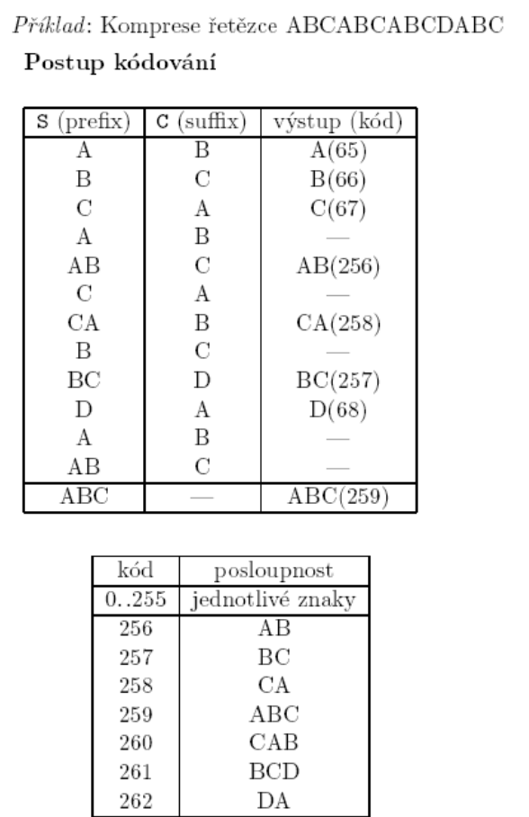
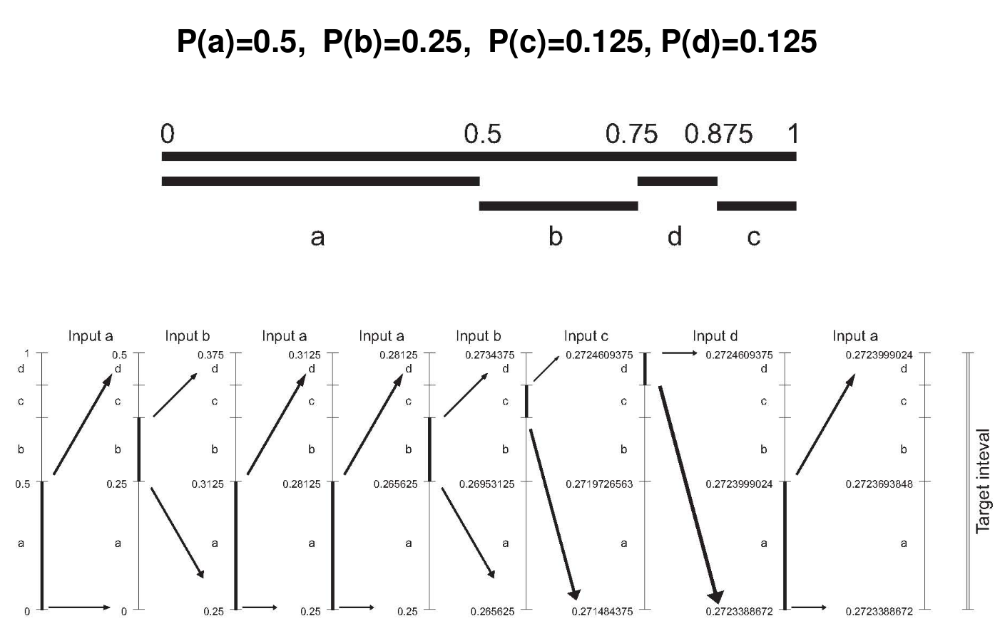
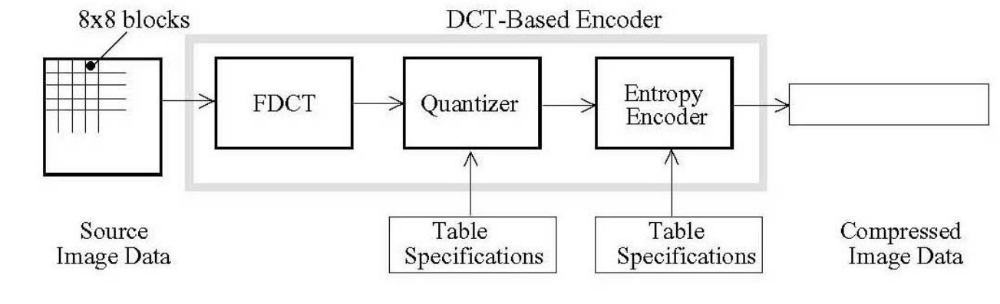
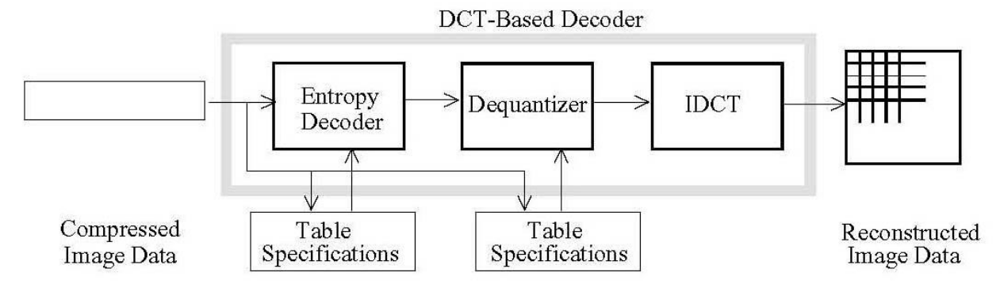
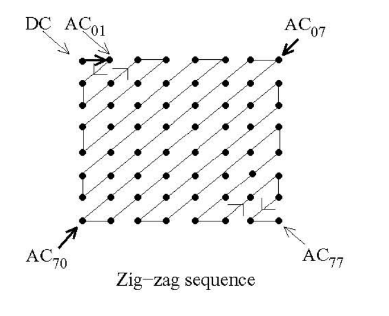

# 19. Algoritmy pro kompresi dat - roztdělení algoritmů, princip základních algoritmů: RLE, LZW, Huffman, Aritmetická komprese, JPEG [KIV/PT]
- **cíl komprese**
    - redukovat objem dat za účelem
        - přenosu dat
        - archivace dat
        - vytvoření distribuce SW
        - ochrana před viry
- **kvalita komprese**:
    - rychlost komprese
    - symetrie/asymetrie kompresního algoritmu
        - symetrické algoritmy - stejný čas potřebný pro kompresi i dekompresi
        - asymetrické algoritmy - čas potřebný pro kompresi a dekompresi se liší
    - kompresní poměr = poměr objemu komprimovaných dat k objemu dat nekomprimovaných
- **typy komprese**
    - **bezztrátová**
        - po kódování a dekódování je výsledek 100% shodný
        - nižší kompresní poměr
        - používají se vyhrádně pro kompresi textu a v případech ,kdy nelze přípustit ztrátu informace
    - **ztrátová**
        - po kódování a dekódování dochází ke ztrátě
        - obvykle vyšší kompresní poměr než bezztrátové
        - lze použít pouze v případech kdy ztráta je akceptovaltelná (komprese obrazů, zvuku)

## Metody komprese
- **jednoduché**
    - založené na kódování opakujících se posloupností znaků (**RLE**)
- **statistické**
    - založené na četnosti výskytu znaků v komprimovaném souboru (Huffmanovo kódování, aritmetické kódování)
- **slovníkové**
    - založené na kódování všech vyskytujících se posloupností (LZV)
- **transformační**
    - založené na ortogonálních popř. jiných transformacích (JPEG, waveletová komprese, fraktálová komprese)

## RLE
- **Run Length Encoding**
    - kódování délkou běhu
- **bezztrátová metoda**
- používá se pro kompresi textů, častěji však pro obrazovou informaci
- princip:
    - _opakující se symboly kódují dvojicí_
    - _(počet opakování, symbol)_
- kódování délky se provádí
    - přímo => u každého znaku je udán počet opakování

```
input: AAAABBCDDDDABD
output: 4A2B1C4D1A1B1D
```

- hlavní nevýhoda:
    - pokud se znaky neopakují často, tak nedochází ke kompresi, ale naopak k prodloužení kódovaného souboru
- pomocí _escape_ sekvencí se kódují pouze opakující se sekvence delší než 3 znaky, kratší sekvence se zapisují přímo do výstupního souboru

```
input: AAAABBCDDDDABD
output: #4ABBC#4DABD
```

- výhoda je, že neprodlužuje soubor, kde není co komprimovat to zůstane v původní podobě
- konkrétní použití
    - formát **BMP**

## LZW
- **Lempel-Ziv-Welch** metoda
- princip
    - vyhledávání opakujícíh se posloupností znaků
    - ukládání těchto posloupností do slovníku pro další použití a přitazení jednoznakového kódu těmto posloupnostem
    - jednoprůchodová metoda (nevyžaduje předběžnou analýzu souboru)
    - kódvané znaky musí mít délku (počet bitů) větší než délka původních znaků (např. pro ASCII znaky se obvykle používá nová délka znaků 12 bitů popř. větší)
    - při průchodu komprimovaným souborem se vytváří slovník (počet položek slovníku odpovídá hodnotě `2^(počet bitů nového kódu)`, kde prvních `2^(počet bitů nového kódu)` jsou znaky původní abecedy a zbývající položky tvoří posloupnosti znaků obsažené v kompriovaném souboru



## Huffmanovo kódování
- statistická metoda komprese
- bezztrátová
- využívá optimálního (nejkratšího) prefixového kódu (kód žádného znaku není prefixem jiného znaku)
- kódové symboly mají proměnnou délku
- metoda je založená na stanovení četnosti výskytů jednotlivých znaků v kódovaném souboru a kódování znaků s největší četností slovem s nejkratší délkou
- algoritmus:
    1. zjištění četnosti jednotlivých znaků v kódovaném souboru
    2. vytvoření binárního stromu 
        - seřadíme posloupnost postupně zleva doprava doprava podle
            - četnosti
            - podstrom bude vlevo před listem, větší podstrom před menším
            - pořadí v abecedě
    3. uložení stromu
    4. nahrazení symbolů jednotlivými kódy (posloupností bitů)
- strom se ukládá na začátek kódované sekvence a přenáší se s komprimovaným souborem. Dekodér si nejprve vytvoří dekódovací strom a pak zpracovává vlastní kód

## Aritmetické kódování
- statistická metoda
- kóduje celou zprávu jako jedno kódové slovo (v původní verzi číslo z intervalu \[0,1).
- bezztrátová
- princip:
    - aritmetické kódování reprezentuje zprávu jako podinterval intervalu <0,1)
    - na začátku uvažujeme celý tento interval
    - jak se zpráva prodlužuje, zpřesňuje se i výsledný interval a jeho horní a dolní mez se k sobě přibližují
    - čím je kódovaný znak pravděpodobnější, tím se interval zůží méně a k zápisu delšího (to znamená hrubšího) intervalu stačí méně bitů
    - na konec stačí zapsat libovolné číslo z výsledného intervalu
- algoritmus:
    1. zjištění pravděpodobnosti _P(i)_ výskytuju jednotlivých znalů ve vstupním souboru
    2. stanovení příslušných kumulativních pravděpodobností _K(0)=0_, _K(i) = K(i-1) + P(i-1)_ a rozdělení intervalu <0, 1) na podintervaly _I(i)_
    3. uložení použitých pravděpodobností
    4. vlastní komprese



- algoritmus pro dekompresi:
    1. rekonstrukce pouižitých pravděpodobností
    2. vlastní dekomprese

## JPEG
- **Joint Photographic Experts Group**
- v současné době patří mezi nejvíce používané komprese u obrázků
- je vhodná pro komprimaci fotek, nevhodná pro např. technické výkresy (čárové výkresy) - dochází k viditelnému rozmazání
- **princip:**
    - části obrazu se transformují do frekvenční oblasti (výsledkem je matice "frekvenčních" koeficientů
    - z matice koeficientů se odstraní koeficienty odpovídající vyšším frekvencím (rychlejší změny jasu - např. hrany v obraze)
    - zbývající koeficienty se vhodným způsobem zkomprimují

- **blokové schéma komprese**



- **blokové schéma dekomprese**



### Kvantizace / dekvantizace
- v tomto kroku se každý z 64 koeficientů DCT (IDCT) vydělí (vynásobí) odpovídajícím prvkem kvantizační matice a zaokrouhlí na nejbližší celé číslo
    - v tomto kroku dochází ke ztrátě informace

### Kódování DCT koeficientů
- koeficienty DCT se obvykle kódují pomocí statistických metod (Huffman, aritmetické kódování)
- koeficient v pozici (0,0) je označen jakjo DC koeficient (stejnosměrná složka), ostatní se označují jako AC koeficienty
- vzhledem k tomu, že DC koeficienty sousedních bloků jsou obvykle silně korelované (tj. střední hodnota jasů sousedních bloků je podobná) kódují se DC koeficienty odděleně od AC koeficientů
- kódování DC koéeficientů - diference hodnot sousedních bloků (DC prvního bloku se kóduje jako přímá hodnota)
    - výsledná hodnota se kóduje jako dvojice
        - **(velikost, amplituda)**
- kódování AC koeficientů - délkou běhu
    - nejprve se koeficienty uspořádají podle následujícího obrázku, pak se kódují jako trojice
        - **(RL, velikost) a (amplituda)**




