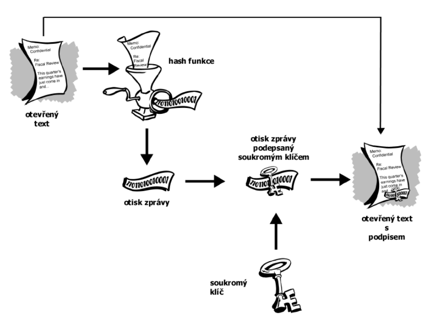

# 20. Kryptografie - rozdělení metod, princip základních metod: steganografie, symetrické a asymetrické šifrování, kryptografická Hash, elektronický podpis. [KIV/PT]

## Steganografie
- _steganos_ = zakryté, tajné
    - _utajené psaní_ => utajení existence zprávy
- příklady:
    - vysílání v rozptýleném spektru (spread spektrum)
    - informace ukrytá do souboru s obrázkem, videem nebo zvukem
        - modifikace nejméně významným bitů -> změna není postřehnutá
- z historie:
    - tajné inkousty, vyrývání zprávy do dřevěné tabulky zalité voskem, apod. 

## Symetrické šifrování
- _E_
    - šifrovací funkce
- _D_
    - dešifrovací funkce
- _K_
    - šifrovací a dešifrovací klíč
- _P_
    - plaintext (znak, blok)
- _C_
    - šifrový text
- **šifrování**
    - `C = Ek (P)`
- **dešifrování**
    - `P = Dk (C)`
- **jeden klíč k šifrování a dešifrování**
- využití S-P sítí
    - substitučně permutační síť
    - skládá se ze **substituce** + **permutace**
    - **P-box** => transpozice vstupu
    - **S-box** => substituce
- šifry:
    - DES
    - AES
    - Blowfish
    - IDEA

### DES
- **Data Encryption Standard**
- využití feistelovy sítě
    - 16 iterací
    - každá iterace podklíč 48 bitů
    - délka bloku = 64 bitů
        - 56 efektivních
        - 8 kontrolních
- **dnes považována za nespolehlivou**
- nahrazeno variantou _Triple DES_
    - klíč 112 bitů

## Asymetrické šifry
- _VKp_
    - šifrovací (veřejný) klíč
- _SKp_
    - dešifrovací (soukromý) klíč
- _P_
    - plaintext
- _C_
    - šifrový text
- **šifrování**
    - _C = EVKp (P)_
- **dešifrování**
    - _P = DSKp(C)_
- pouze ten, kdo má soukromý, dešifrovací, klíč, může dešifrovat zašifrovanou zprávu

### Zavazadlový algoritmus
- založen na NP složitosti zavazadlového (knapsack) problému
- dnes označen za nevyhovující

### RSA
- dnes nejznámější a nejpoužívanější
- dostatečná délka klíče => považván za bezpečný
- vhodný pro šifrování i pro el. podpis
- princip:
    - rozklad velkého čísla na součin prvočísel (faktorizace) => **velmi obtížná úloha**
    - žádný algoritmus faktorizace, který by pracoval alespoň v polynomiálním čase vůči velikosti binárního zápisu čísla _n_
    - z čísla _n_ (_n = p * q_) praktická nemožnost zjištění _p_ a _q_ v "rozumném čase
    - je třeba volit dostatečně velká prvočísla (100-200 míst)
- popis

### El Gamalův systém
- založen na obtížnosti výpočtu diskrétních logaritmů v konečném tělese
- neváhoda: délka šifrového textu = 2x délka otevřeného textu  

## Hashování
- hash => **jednocestná funkce, která z libovolně dlouhého textu vyrobí krátký řetězec konst. délky**
- motivace
    - "rychlost" asymetrických šifer
    - závislost bezpešnosti na volbě klíče a obsahu zprávy (ovlivnitelné člověkem)
- **vlastnosti hashovací funkce**
    1. _P_ -> jednoduchost výpočtu _H(P)_
    2. _H(P)_ -> nemožnost nalezení _P_
    3. platí pro každé _P1_ a _P2_, pokud _H(P1) = H(P2)_ => _P1 = P2_
    4. libovolné množství vstupních dat (délka zprávy) -> otisk (hash) **konstantní** délky
    5. drobná změna vstupních dat -> **velká** změna otisku
- rozdělení
    - bez klíče
        - MDC, pro detekci s manipulací
    - s klíčem
        - MAC (Message Authentication Codes)
        - ostatní
- **použití**
    - kontrola integrity dat
    - digitální podpis
    - ukládání hesel
    - porovnání shodnosti obsahu kopií dat
    - generování pseudonáhodných posloupností
- příklady
    - MD5
        - dnes již není považována za bezpečnou
        - nalezeny specifické kolize
    - SHA-1
- útoky:
    - hledání kolizí
        - najdu kolizi, fce již **není bezpečná**
        - digitální podpis ztrácí důvěryhodnotu
    - slovníkový útok
        - pro vstup počítám hashe
    - rainbow
        - ukládám pouze konec hashů, se kterým porovnávám hash, zbytek dopočítávám
- ochrana proti útokům
    - salting
        - do hashovací funkce ještě nějaké _tajné heslo_

## Digitální podpis

- založena na kontrolním součtu a vlastnostech asymetrické kryptografie

- příjemce:
    - ověření podpisu (rozšifrování hashe) pomocí veřejného klíče autora
- vlastnosti
    - příjemce
        - možnost ověření identity odesílatele zprávy
        - nemožnsot změny obsahu zprávy
    - odesílatel
        - nemožnost pozdějšího odmítnutí obsahu dig. podepsané zprávy
- certifikáty
    - zajištění přenosu veřejných klíčů po nezabezpečeném kanálu;
