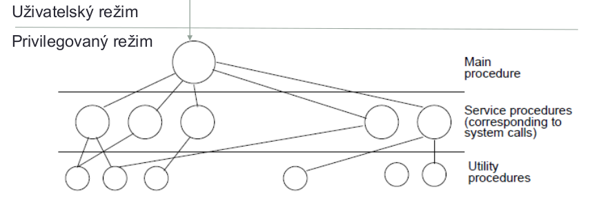

# 21. Základní moduly OS a jejich funkce. Rozdělení OS. Vyvolání služeb OS, zpracování přerušení. [KIV/ZOS]

- **operační systém**
    - softwarová vrstva (základní programové vybavení), jejíž úlohou je spravovat hardware a poskytovat k němu programům jednotné rozhraní
    - zprostředkovává aplikacím **přístup** k hardwaru
    - **koordinuje zdroje** a **poskytuje** služby alpikacím
        - zdroje = čas na procesoru, přidělená paměť disk, síťová karta
    - **program**, který slouží jako **prostředník** mezi aplikacemi a hardwarem počítače

## Moduly OS

- **modul pro správu procesů**
    - program, proces, vlákno, plánování procesů a vláken
    - kritická sekce, souběh, synchronizace (semafory, ...)
    - deadlock, vyhladovění
- **modul pro správu paměti**
    - virtuální paměť: stránkování, segmentace
- **modul pro správu I/O**
- **modul pro správu souborů**
- **síťování**
- **ochrana a bezpečnost**
- **uživatelské rozhraní**

## Rozdělení OS

- dle architektury
- **monolitické jádro**
    - jádro je jeden funkční celek
- **mikrojádro**
    - malé jádro, oddělitelné části pracují jako samostatné procesy v user space
- **hybridní jádro**
    - kombinace
- příklady
    - **Linux** => monolitické jádro
    - **Windows 10** => hybridní jádro
    - **Max OS X** => hybridní

### Monolitické jádro
- jeden spustitelný soubor
- uvnitř moduly pro jednotlivé funkce
- jeden program, řízení se předává voláním podprogramů
- typickou součástí monolitického jádra je např. souborový systém
- Linux je monolitické jádro operačního systému s podporou zavádění modulů za běhu systému

### Vrstvené jádro

- výstavba systému od nejnižších vrstev
- vyšší vrstvy využívají primitiv poskytovaných nižšími vrstvami
- hierarchie procesů
    - nejníže vrstvy komunikující s HW
    - každá vyšší úroveň poskytuje abstraktnější virtuální stroj
    - může být s HW podporou - pak nelze vrstvy obcházet (obdoba systémového volání)
- příklady
    - THE, MULTICS

### Mikrojádro

- model **klient - server**
- většinu činností OS vykonávají **samostatné procesy mimo jádro** (servery, např. systém souborů)
- mikrojádro
    - poskytuje pouze nejdůležitější nízkoúrovňové funkce
    - pouze mikrojádro běží v privilegovaném režimu
        - méně pádu systému
- _činnosti vyžadující privilegovaný režim je stále nutné provést v mikrojádře - pouze to je v privilegovaném režimu CPU_
- **výhody**
    - vynucuje modulární strukturu
    - snadnější tvorba distribuovaných OS (kouminakce přes síť)
- **nevýhody**
    - složitější návrh systému
    - režie (4 x přepnutí uživatelský režim <-> jádro)
- potřebujeme nejen mikrojádro, ale i servery
    - mikrojádro Mach + kolekce serverů Hurd
- příklady
    - QNX, Hurd, OSF/1, MINIX, Amoeba
- základní služby běží v privilegovaném režimu
    1. proces vyžaduje službu
    2. mikrojádro předá požadavek příslušnému serveru
    3. server vykoná požadavek
- snadná vyměnitelnost serveru za jiný
- **chyba serveru nemusí být fatální pro celý operační systém**
- distribuované systémy - server může běžet i na jiném uzlu sítě

## Systémové volání

- _mechanismus používaný aplikacemi k volání služeb operačního systému_
- důvod:
    - v uživatelském režimu CPU není možné celou řadu věcí vykonat - **není přímý přístup k HW**, nelze tedy přímo přečíst blok z disku, tedy otevřít soubor, číst z něj a zapisovat do něj
    - pokud aplikace takoavou činnost požaduje, nezbývá jí, než požádat o danou službu operační systém
    - OS zkontroluje, zda má aplikace pro danou činnost oprávnění a pokud ano, požadovanou činnost vykoná
- pojem **systémové volání** znamená vyvolání služby operačního systému
- aplikace, která chce volat nějakou službu
    - přímo systémové volání (_open, creat_)
    - prostřednictvím **knihovní funkce** (v C např. fopen), která následně požádá o systémové volání sama
- výhodou knihovní funkce je, že je na různých platformách stejná, ať už se vyvolání systémové služby děje různým způsobém na různých platformách
- příklad:
    1. do vybraného registru EAX uložím číslo služby, kterou chci vyvolat
        - např. 1 - ukončení procesu
        - 2 - vytvoření dalšího procesu
        - 3 - zápis do souboru
    2. do dalších registrů uložtím další potřebné parametry
    3. provedu instrukci, která mě přepne do režimu jádra
        - INT 0x80 nebo _sysenter_
    4. v režimu jádra se zpracovává požadovaná služba
    5. návrat, uživatelský proces pokračuje dále

## Přerušení

- **přerušení = událost**
- obsluha přerušení = obsluha události
- asynchronní 
    - může přijít kdykoliv, HW, stisk klávesy)
- synchronní 
    - instrukce SW přerušení v programu - INT
    - přijde očekávaně
- přerušení je _metoda pro asynchronní obsluhu událostí, kdy procesor přeruší vykonávání sledu instrukcí, vykoná obsluhu přerušení a pak pokračuje v předchozí činnost_
- rozdělení
    - **HW přerušení** - obsluha HW zařízení
        - původ v HW
        - stisk klávesy, pohnutí myší
        - časovač (timer)
        - disk, síťová karta, ztráta napájení
    - **SW přerušení** - synchronní instrukcí `INT x` v kódu procesu
    - **vnitřní přerušení (výjimky)** - procesor oznamuje chyby při vykonávání instrukcí (např. dělení nulou)
- použití přerušení
    - systémové volání
    - výpadek stránky paměti
    - obsluha HW zařízení
- _vektor přerušení je index do pole obsahující **adresu obslužné rutiny**, vykonané při daném typu přerušení_
- **maskovatelné přerušení** - v době obsluhy přerušení (musí byt rychlá) lze zamaskovat méně důležitá přerušení
- obsluha přerušení může mít 2 části
    - první část
        - ve vlastním režimu obsluhy přerušení
        - velmi rychlé (stabilita)
    - odložená část
        - může naplánovat další část, která se vykoná "až bude čas"
- **pokud přijde přerušení:**
1. přijde signalizace přerušení
2. dokončena rozpracovaná strojová instrukce
3. na zásobník je **uloženo stavové slovo procesoru (registru FLAGS)**
4. je nastaven **zákaz přerušení** (změna bitu stavového slova), aby naši obsluhu nic dalšího nepřerušovalo (příklad - 2x stisknu klávesu)
5. na zásobník **uložena adresa následující** instrukce, kterou chceme v daném procesu dále pokračovat
6. z vektoru přerušení zjistí adresu podprogramu pro obluhu přerušení
7. obsluha - rychlá
    - nejčastěji uložíme registry na zásobník a před koncem obsluhy je zas vybereme, abychom je procesu, který jsme přerušili nezměnili
    - na konci stejný stav procesoru (hodnoty registrů) jako na začátku (pokud neslouží k předání výsledku)
8. instrukce návratu **IRET**
    - vyzvedne ze zásobníku návratovou adresu a stavové slovo (a tím i povolí přerušení, protože ve stavovém slovu je původní hodnota bitu přerušení)
    - běh pokračuje na návratové adrese
- přerušená úloha nepozná, že proběhla obsluha přerušení
