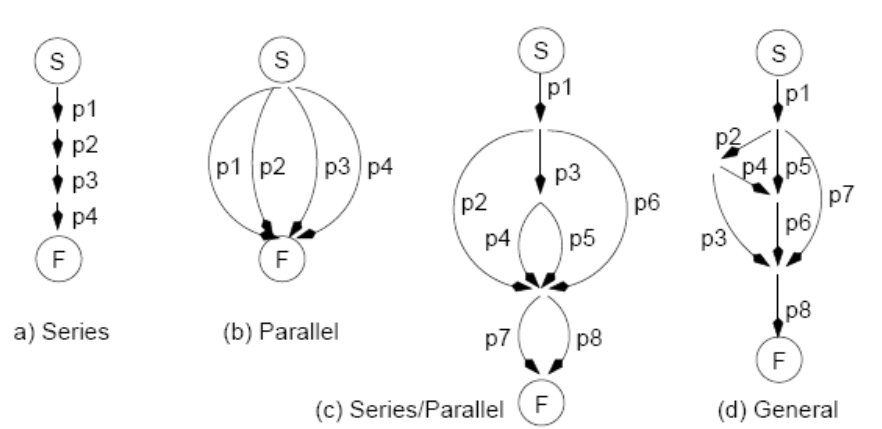
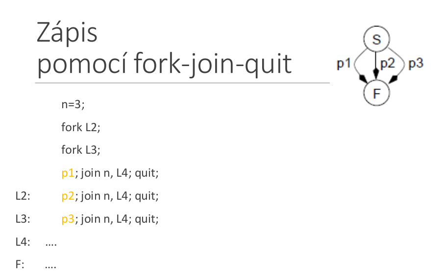
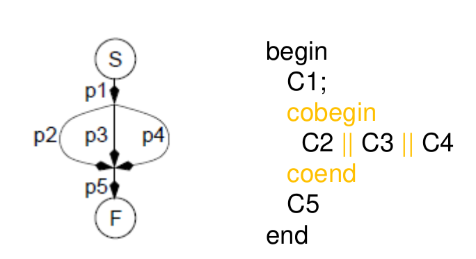
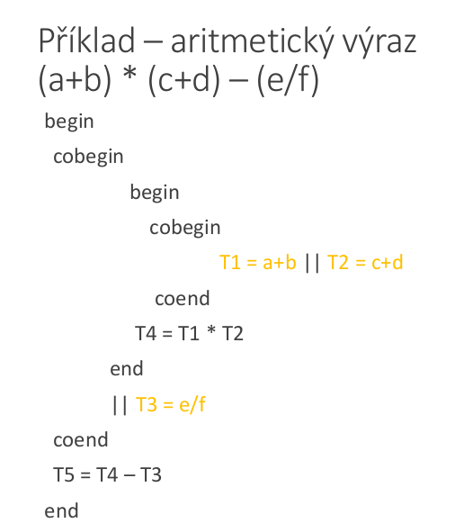

# 22. Proces, implementace procesu, základní služby OS pro práci s procesy. Paralelní procesy, prostředky pro popis paralelním procesů, vlákna [KIV/ZOS]
- **proces**
    - instance běžícího programu
- **adresní prostor** procesu
    - proces typicky používá **virtuální paměť**, která se mapuje do **fyzické paměti**
- s procesem jsou sdruženy registry a další info potřebné k běhu procesu = **stavové informace**
    - čítač funkcí **PC**, ukazatel zásobníku **SP**
- základní stavy procesu
    - **běžící**
        - skutečně využívá CPU, vykonává instrukce
    - **připravený**
        - dočasně pozastaven, aby mohl jiný proces pokračovat
    - **blokovaný**
        - neschopný běhu, dokud nenastane externí událost

## Implementace procesu
- koncepčně má každý proces vlastní **virtuální** CPU
- běžící program včetně obsahu čítače instrukcí, registrů, proměnných, běží ve vlastní paměti
- reálný procesor - přepíná mezi procesy (multiprogramování)
- **pseudoparalelní běh**
    - v jednu chváli aktivní pouze **jeden** aktivní proces
    - po určité době **pozastaven** a spuštěn další
    - po určité doě všechny procesy vykonají část své činnost

## Základní služby OS pro práci s procesy
- vytvoření nového procesu
    - `fork` v UNIXu
    - `CreateProcess` ve Win32
- ukončení procesu
    - `exit` v UNIXu
    - `ExitProcess` ve Win32
- čekání na dokončení potomka
    - `wait(waitpid)` v UNIXu
    - `WaitForSIngleObject` ve Win32
- alokace a uvolnění paměti procesu
- komunikace mezi procesy (IPC)
- identifikace ve víceuživatelských systémech
    - identifikátor uživatele `UID`
    - skupina uživatele `GID`
    - proces běží s `UID` toho, kdo ho spustil
    - v UNIXu - `UID`, `GID` - celá čísla
- **fork**
    - vytvoří identickou kopii původního procesu
    - vykonává stejný kód
    - má jiný PID
    - návratová hodnota fork
        - rodič => nenulová hodnota (PID potomka)
        - potomek - nula (signalizuje, že je potomek)
        ```
        if (fork() == 0) potomek else rodic
        ```
    - potomek něco dělá a potom může činnost ukončit pomocí `exit()`
    - rodič může na potomka čekat `wait()`


## Vlákna
- mohou být implementována v
    - jádře
    - uživatelském prostoru
    - kombinace
- vlákna v procesu sdílejí atributy procesu
    - adresní prostor
    - otevřené soubory
- mají soukromý
    - čítač instrukcí
    - obsah registrů
    - soukromý zásobník
    - mohou mít soukromé **lokální** proměnné
- použití
    - interaktivní procesy
    - webový prohlížeč
    - textový procesor
    - www servery
- **multithreading**
    - proces začíný svůj běh s jedním vláknem, ostatní vytvoří za běhu programově

### Precendenční grafy
- _process flow graph_
- popis pro vyjádření různých relací mezi procesy
- acyklický orientovaný graf
- běh procesu pi - orientovaná hrana grafu
- vztahy mezi procesy - sériové nebo paralelní spojení - spojením hran



### Fork, join, quit
- mechanismus pro obecný popis paralelních aktivit
- primitiva
    - `fork X;`
        - spuštění nového vlákna od příkazu označeného návěštím X; nové vlákno poběží paralelně s původním
    - `quit;`
        ukončí vlákno
    - `join t, Y;`
        - atomicky nedělitlně provede `t = t - 1; if (t == 0) then goto Y;`



## Abstraktní primitiva cobegin a coend
- specifikuje sekvence programu, která má být hbed spuštěna paralelně
- každé Ci je autonomní segment kódu (blok)
- samostatné vlákno pro všechna Ci
- Ci běží nezávisle na ostatních
- program pokračuje až za coend až po skončení posledního Ci




- maximální paralelismus
    - část výpočtu spustím ihned jak ej to možné
