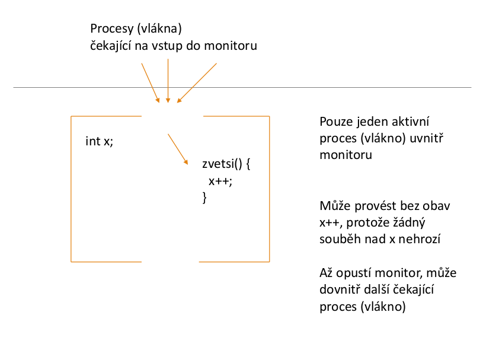
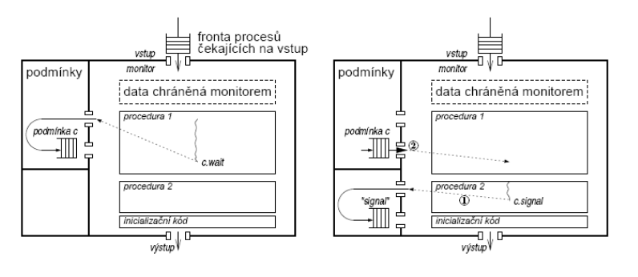

# 23. Problém kritické sekce. Prostředky pro synchronizaci procesů. Semafory, jejich použití a implementace. Monitory

## Kritická sekce
- kritická sekce je místo v programu, kde je prováděn přístup ke společným datům
- procesy, vlákna komunikují přes společnou datovou oblast
    - sdílená paměť - procesy
    - globální proměnné - vlákna
- cílem je zařídit, aby byl v kritické sekci v daný okamžik pouze **jeden** proces (vlákno)
- společná datová oblast
    - hlavní paměť, sdílené proměnné x,y,z
    - soubor `s1`
        - souběžně do něj zapisuje a čte více procesů
        - zamykání části souboru - řeší časový souběh
- každá kritická sekce se vztahuje ke konkrétním datům, ke kterým se v ní přistupuje (x, y, z, s1,..)
- počet kritických sekcí
    - kritická sekce nemusí být jedna
    - pokud procesy sdílejí tři proměnné `x`, `y` a `z`
        - každá z nich představuje **KSx**, **KSy** a **KSz**
        - nelze označit za jednu KS, jelikož bychom potom zbytečně blokovali přístup k `y`, když řešíme souběh nad `x` atd.
- proces běžící mimo kritickou sekci nesmí blokovat jiné procesy (např. jim bránit ve stupu do kritické sekce)
- řešení
    - zákaz přerušení
    - aktivní čekání
    - zablokování procesu

## Zákaz přerušení
- vadí nám přeplánování procesů
    - může nastat v nevhodný čas
    - k přeplánování dojde díky přerušení

```
zakaž přerušení
kritická sekce
povol přerušení
```

- nejjednodušší řešení na uniprocesoru
- není dovoleno v uživatelském režimu
    - uživatel by zakázal přerušení a už by třeba nepovolil
- používáno často uvnitř jádra OS
- není vhodné pro uživatelské procesy

## Aktivní čekání
- zápis a čtení ze společné datové oblasti jsou nedělitelné operace
    - současný přístup více procesů ke stejné oblasti povede k sekvenčním odkazům v neznámém pořadí
    - tedy 2 procesy chtějí přistoupit -> výsledek sekvenční provedení CPU instrukcí
    - platí pro data <= délce slova
- kritické sekce nemohou mít přiřazeny prioritu
- relativní rychlost procesů je neznámá
- proces se může pozastavit mimo kritickou sekci
- problémy
    - ztracený čas CPU
        - jeden proces v KS, další může ve smyčce přistupovat je společným proměnnným
        - krade paměťové cykly aktivnímíu procesu
    - problém inverze priorit
        - pokud procesy mají prioritu
        - dva procesy, jeden s vysokou H a druhý s níkou L prioritou, H se spustí jakmile je připraven

## Spin lock s instrukcí TSL
- CPU instrukce, která otestuje hodnotu a nastaví paměťové místo v jedné nedělitelné operaci
- provádí se nedělitelně
- proměnná typu zámek (lock) - na počátku 0 = odemčeno
- proces který chce do KS vstoupit - testuje
    - pokud 0 - nastaví na 1 a vstoupí do KS
    - pokud 1 - čeká


## Synchronizace procesů
- procesy se navzájem potřebují, potřeba vzájemné výměny informací
- nejjednodušší případ - pouze synchronizační signály
- obvykle i další informace, např. zasíláním zpráv

### Semafory

- zjednodušuje komunikaci a synchronizaci procesů 
- **proměnná**, obsahuje celé nezáporné číslo
- semaforu lze přiřadit hodnotu pouze při deklaraci
- nad semafory pouze operace `P(s)` a `V(s)`

```
typedef struct {
    int hodnota;
    process_queue *fronta;
} semaphore;

# zablokuje proces, který chtěl provést operaci P
# přidá jej do fronty procesů čekajících na daný semafor
# stav procesu označí jako blokovaný
P(S):
    if S > 0:
        S--;
    else:
        zablokuj proces;

# podívá se, zda je fronta prázdná či ne
- ouzační stav procesu jako připravený a vyjme proces z fronty na semafor
V(S):
    if proces_blokovany_nad_semaforem:
        jeden_proces_vzbud;
    else:   
        s++;
```

- pokud je nad semaforem S zablokovaný jeden nebo více procesů, vzbudí jeden z procesů (proces pro vzbuzení je vybrán **náhodně**
- semafor je tvořen celočíselnou proměnnou `s` a frontou procesů, které čekají na semafor a jsou nad ním implementovány operace `P()` a `V()`
- hodnota 0 znamená, že je semafor zablokovaný a prvním voláním, operace `P()` se daný proces zablokuje
- nenulová hodnota `s` znamená, kolik procesů může zavolat operaci `P()`, aniž by došlo k jejich zablokování
- pro vzájemné vyloučení je tedy počátční hodnotu `s` potřeba nastavit na `1`, aby operaci `P()` bez zablokování mohl vykonat jeden proces
- operace `P()` a `V()` jsou nedělitelné atomické akce
- použití
```
var s: semaphore = 1;

P(s);
KS1;
V(s);
```
- atomické operace `P` a `S`?
    - třeba použít mutex
### Mutexy
- synchronizační prostředek pro vzájemné vyloučení
    - typicky vyloučení vláken v jednom procesu
- méně náročný než semafor
- použití když nepotřebujeme schopnost semaforů počítat - jen vzájemné vyloučení
- chceme _spin-lock bez aktivního čekání_
- mutex řeší vzájemné vyloučení a je k systému šetrnější než čistě aktivní čekání spin-lock můžeme jej naimplementovat např. pomocí `TSL` instrukce a volání `yield`
- s koncepcí vlastnictví
    - _odemknout mutex může jen stejné vlákno/proces, který jej zamkl_
- **reentrantní mutex**
    - stejné vlákno může získat několikrát zámek
    - stejně tolikrát jej musí zas odemknout, aby mohlo mutex získat jiné vlákno

### Futex
- rychlejší než mutex
- jedná se o userspace mutex
- sys. volání je obvykle nákladná záležitost, proto je snaha minimalizovat jejich počet

### Monitory
- synchronizační mechanismus
- snaha najít primitiva vyšší úrovně, která zabrání části potenciálních chyb
- Hoare a Hansen nezávisle na sobě navrhli vysokoúrovňové synchronizační primitivum nazývané **monitor**
- narozdíl od semaforů se jedná o jazykovou konstrukci
- speciální typ modulu, jenž sdružuje data a procedury, které s nimi mohou manipulovat
- procesy mohou volat proceduru monitoru, ale nemohou přistupovat přímo k datům monitoru
- v monitoru může být v jednu chvíli aktivní pouze jeden proces
    - ostatní procesy jsou při pokusu o vstupi do monitoru pozastaveny



- blok podobný proceduře nebo funkci
- proměnné monitoru
    - nejsou viditelné zvenčí
    - dostupné pouze procedurám a funkcím monitoru
- procedury a funkce
    - viditelné a volatelné vně monitoru
- speciální typ proměnné nazývané **podmínka** (condition variable)
    - definovýny a použity pouze uvnitř monitoru
    - nejsou proměnné v klasickém smyslu, neobsahují hodnotu
    - spíše odkaz na určitou událost nebo stav výpočtu
    - představují frontu procesů, které na danou podmínku čekají
. operace nad podmínkami
    - `wait`, `C.wait`
        - volající bude pozastaven nad podmínkou C
        - pokud je některý proces připraven vstoupit do monitoru, bude mu to dovoleno
    - `signal`, `C.signal`
        - pokud existuje 1 a více procesů pozastavených nad podmínkou C, reaktivuje jeden z pozastavených procesů
    - tj. bude mu dovoleno pokračovat v běhu uvnitř monitoru
    - pokud nad podmínkou nespí žádný proces, nedělá nic
        - rozdíl oproti semaforové operaci `V(sem)`, která si "zapamatuje" že byla zavolána



- problém s operací `signal`
- pokud by signál pouze vzbudil proces, běžely by v monitoru dva procesy
    - vzbuzený proces
    - a proces co zavolal `signal`
- **rozpor** s definicí monitoru
    - v monitoru může být v jednu chvíli **aktivní** pouze jeden proces
- řešení reakce na signal
    - **Hoare**
        - proces volající `c.signal` se pozastaví
        - vzbudí se až poté, co předchozí reaktivovaný proces opustí monitor nebo se pozastaví
    - **Hansen**
        - `signal` smí být uveden pouze jako poslední příkaz v monitoru
        - po volání `signal` musí proces opustit monitor
- výhoda monitorů
    - automaticky řeší vzájemné vyloučení
    - větší odolnost proti chybám programátora
- nevýhoda
    - koncepce programovacího jazyka, překladač je musí umět rozpoznat a implementovat
- implementace monitorů
    - např. pokud OS poskytuje semafory, jsou využity pro implementaci monitoru
- implementace musí zaručit
    - nanejvýš 1 aktivní proces v monitoru
    - `wait` musí blokovat aktivní proces v příslušné podmínce
    - když proces opustí monitor, nebo je blokován podmínkou `AND` existuje >1 procesů čekajících na vstup do monitoru => musí být jeden z nich vybrán
    - `signal` musí zjistit, zda existuje proces čekajících nad podmínkou
        - **ANO** - aktuální proces je pozastaven a jeden z čekajících reaktivován
        - **NE** - pokračuje původní proces

### Bariéry
- synchronizační mechanismus pro **skupiny procesů**
- aplikace - skládá se z fází
    - žádný proces nesmí do následující fáze dokud všechny procesy nedokončily fázi předchozí
- na konci každé fáze - synchronizace na bariéře
    - volajícího pozastaví
    - dokud všechny procesy také nedorazí do bariéry
- všechny procesy pak opustí bariéru současně
- např. implementace pomocí monitorů

