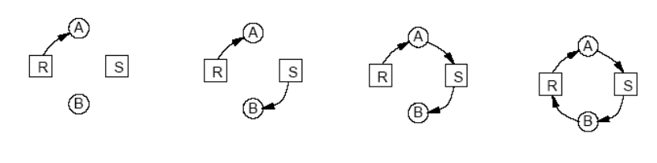
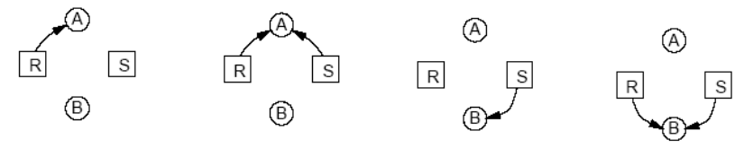
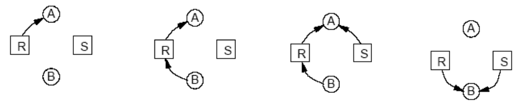

# 24. Problém uvíznutí procesů - řešení a předcházení, graf alokace zdrojů. Klasické problémy meziprocesové komunikace, producent-konzument

## Problém uvíznutí procesů
- **vyhladovění** (starvation)
    - proces se nedostane k požadovaným zdrojům i přesto, že nenastalo uvíznutí
    - příklad:
        - tiskárnu dostane proces, který chce vytisknout nejkratší soubor
        - 1 proces chce velký soubor, tiskárna obrdží hodně malých požadavků - může dojít k vyhladovění, proces je neustále předbíhán

- **problém uvíznutí** (deadlock)
    - _cyklické čekání dvou či více procesů na událost, kterou může vyvolat pouze některý z nich, nikdy k tomu však nedojde_

### Podmínky uvíznutí
- **4 coffmanovy podmínky vzniku uvíznutí**
    1. **vzájemné vyloučení** - výhradní přiřazování zdrojů
    2. **hold and wait** - proces držící zdroje může požadovat další
    3. nemožnost zdroje odejmout
    4. cyklické čekání
- pokud některá podmínka není splněna -> uvíznutí je strukturálně nemožné
    - strukturálně negujeme jednu z Coffmanových podmínek => **nemůže dojít k uvíznutí**

### Jak se vypořádat s uvíznutím?
- možnosti
    1. problém uvíznutí je zcela ignorován
    2. detekce a zotavení
    3. dynamické zabránění pomocí pečlivé alokace zdrojů
    4. prevence pomocí strukturální negace jedné z dříve uvedených nutných podmínek pro czik uvíznutí
- **spooling**
    - pouze daemon přistupuje k tiskárně
    - nikdy nepožaduje další zdroje - není uvíznutí
    - převádí soutěžení o tiskárnu na soutěžení o diskový prostor
        - soutěžení o zdroj, "kterého je více"
    - pokud ale 2 procesy zaplní disk se spool souborem, žádný nemůže skončit
    - spooling není možný pro všechny zdroje
- **požadovat aby procesy alokovaly všechny zdroje před svým spouštěním**
    - většinou nevědí, které zdroje budou chtít
    - příliš restriktivní
    - některé dávkové systémy i přes nevýhody používají, zabraňuje deadlocku
    - modifikace:
        - pokud proces požaduje nové zdroje, musí uvolnit zdroje které drží a ovšechny požádat v jediném požadavku
- **nemožnost zdroje odejmout**
    - odejímat zdroje je velmi obtížné
    - proces může zanechat zdroj v nekonzistentním stavu
- **cyklické čekání**
    - proces může mít jediný zdroj, pokud chce jiný musí předchozí uvolnit - restriktivní, není řešení
    - všechny zdroje očíslovány, požadavky musí být prováděny v číselném pořadí
        - alokační zdroj nemůže mít cykly
        - problém - je těžké nalézt vhodné očíslování pro všechny zdroje
        - není použitelné obecně, ale ve speciálních přápadech výhodné (jádro OS, db systém,...)
- **dvoufázové zamykání**
    - používanjé v DB systémech
    - **první fáze**
        - zamknutí všech potřebných zánků v číselném pořadí
        - pokud je některý zamknut jiným procesem, tak uvolní všechny zámky a zkusí znovu
    - **druhá fáze**
        - čtení a zápis, uvolňování zámků
    - zamyká se vždy v číselném pořadí, uvíznutí nemůže nastat

## Graf alokace zdrojů
- 2 typy uzlů
    - **proces** - zobrazujeme jako kruh
    - **zdroj** - jako čtverec
- hrany:
    - hrana od zdroje k procesu:
        - **zdroj držen procesem**
    - hrana od procesu ke zdroji
        - **proces blokován čekáním na zdroj**
- pokud se v grafu nachází cyklus => nastalo uvíznutí
- uvíznutí se týká procesů a zdrojů v cyklu
- příklad:
    - zdroje: Recorder **R**, Scanner **S**, procesy **A**, **B**
    - postup:
        1. **A** žádá **R** dostane, **B** žádá **S** dostane
        2. **A** žádá **S** a čeká, **B** žádá **R** a čeká => **UVÍZNUTÍ**



- cyklus grafu je **nutnou a postačující** podmínkou pro vznik uvíznutí
- závisí na pořadí vykonávání instrukcí procesu
- pokud nejprve alokace a uvolnění zdrojů procesu **A**, potom **B** => uvíznutí **nenastane**

- příklad 2, kdy uvíznutí nenastane:
    1. **A** žádá **R** a **S**, oba dostane, **A** oba zdroje uvolní
    2. **B** žádá **S** a **R**, oba dostane, **B** oba zdroje uvolní



- příklad 3, kdy uvíznití **nenastane** - procesy **A** a **B** žádají zdroje **R** a **S** ve stejném pořadí
    1. **A** žádá **R** a dostane, **B** žádá **R** a čeká
    2. **A** žádá **S** a dostane, **A** uvolní **R** a **S**
    3. **B** čekal na **R** a dostane, **B** žádá **S** a dostane



## Meziprocesová komunikace
- **IPC** (interprocess communication)
- komunikace:
    - sdílená paměť
        - předpoklad: procesy na stejném uzlu
    - zasílání zpráv
        - na stejném uzlu i na různých uzlech
- **problém sdílené paměti**
    - IPC vyžadike umístění objektu ve sdílené paměti
    - někdy to není vhodné
        - bezpečnost => globální data přístupná kterémukoliv procesu/vláknu (co, když nebudou řídit přístup semaforem, mutexem?)
    - někdy to není možné
        - procesy běží na různých strojích, komunikují spolu po síti
### **Předávání zpráv**
- 2 primitiva
    - `send(adresat, zprava)`
    - `receive(odesilatel, zprava)`
- v Linuxu systémová volání `msgsnd()` a `msgrcv()`
    - pošle/přijme zprávu do/z fronty zpráv
-  `receive` typicky bývá blokující
- `send` typicky bývá asynchronní
    - předá zprávu jádru a dál se nestará
- `receive` může být s timeoutem (omezeným čekáním)
- adresování
     - **send:** 1 příjemce nebo skupina?
     - **receive:** 1 odesílatel nebo různí?
- skupinové a všesměrové adresování
    - **multicast**
        - skupinové adresování
        - zprávu pošleme skupině procesů
        - zprávu obdrží každý proces ve skupině
    - **broadcast**
        - zprávu posíláme **všem** procesům
        - tj. **více** nespecifikovaným příjemcům
    - **anycast** z _IPv6_
- dnes typicky většina systémů umožňuje:
    - odeslání zprávy skupině procesů
    - příjem zprávy od kteréhokoliv procesu
- pokus odeslat zprávu v moment, kdy je fronta plná?
    - většinou odesílatel pozastaven
- zprávy zpracovávány většinu v pořadí FIFO
- velikost fronty (_buffering_)
    - **randezvous**
        - nulová délka fronty zpráv
        - žádná zpráva nebude čekat
        - odesílatel se zablokuje a čeká na příjemce
    - **omezená kapacita**
        - blokování při dosažení kapacity
    - **neomezená kapacita**
        - odesílatel se nikdy nezablokuje

## Producent - konzument
- symetrický problém
- producent **generuje plné** položky
    - pro využití konzumentem
- konzument **generuje prázdné** položky
    - pro využití producentem
- řešení pomocí zasílání zpráv

```
cobegin

    while true do
    begin
        produkuj záznam;
        receive(konzument, m); // čeká na prázdnou položku
        m = záznam;
        send(konzument, m);
    end

    ||

    for i=1 to N do:
        send(producent, e); // pošleme N prázndných položek

    while true do
    begin
        receive(producent, m); // přijme zprávu obsahující data
        zaznam = m;
        send(producent, e);
        zpracuj zaznam;
    end

coend

```            

## Předcházení a řešení uvíznutí/vyhladovění

## Klasické problémy IPC
- testovatelnost synchronizačních mechanismů se testuje na vybraných úlohách

### Problém večeřících filozofů
- model procesů soupeřících o výhradní přístup k omezenému počtu zdrojů
    - může dojít k zablokování, vyhladovění
- scénář:
    - 5 filozofů sedí kolem kulatého stolu
    - každý filozof má před sebou talíř se špagetami
    - mezi každáma dvěma talíři je vidlička
    - filozof potřebuje dvě vidličky, aby mohl jíst
    - na stole 5 vidliček
    - činnosti filozofů
        - jí a přemýšlí
        - když dostane hlad, pokusí se vzít dvě vidličky
            - nějakou dobu jí, pak položí vidličky a pokračuje v přemýšlení
    - úkolem
        - napsat program pro každého filozofa, aby pracoval dle předpokladů a nedošlo k potížím
        - aby se každý najedl

### Problém čítařů a písařů
- modeluje přístup do databáze
- rezervační systém (místenky, letenky)
- množina procesů, které chtějí přistsupovat
    - souběžné čtení lze
    - výhradní zápis
- často praktická úloha, lze realizovat s předností čtenářů nebo s předností písařů
    - pro komerční aplikace je samozžejmě vhodnější přednost písařů

### Spící holič

- holičství
- čekárna s _N_ křesly a holičské křeslo
- žádný zákazník - holič spí
- zákazník vstoupí
    - všechna křesla obsazena - odejde
    - holič spí - vzbudí ho
    - křesla volná - sedne si na jedno z volných křesel
- cílem úlohy je napsat program, koordinující činnost holiče a zákazníků
