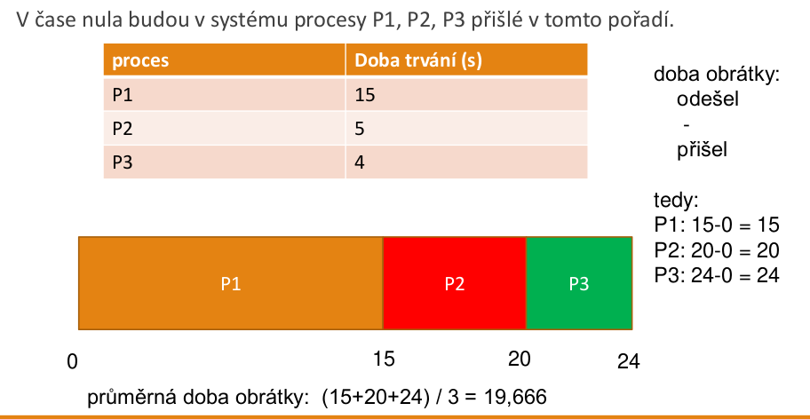
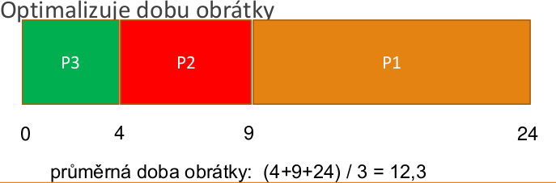
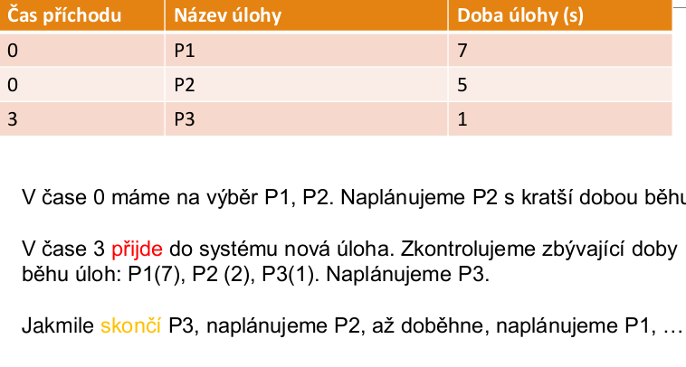
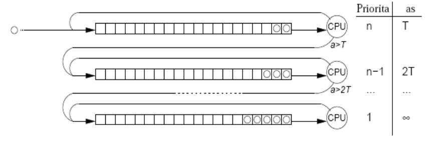

# 25. Plánování úloh a procesů v dávkových systémech
- **dávkové systémy**
    - dlouhý čas na CPU omezí se přepínání úloh
- **plánovač**
    - rozhodovací mód
        - okamžik, kdy jsou vyhodnoceny priority procesu a vybrán proces pro běh (KDY)
    - prioritní funkce
        - určí prioritu procesu v systému
    - rozhodovací pravidla
        - jak rozhodnout při stejné prioritě
- cíle plánování (společné)
    - spravedlivost
        - srovnatelné procesy srovnatelně obsloužené
    - vynucení politky
        - bude vyžadováno dodržení stanovených pravidel
    - balance
        - snaha aby všechny části systému (CPU, RAM, periferie) byly vytížené
- cíle plánování (**dávkové systémy**)
    - propustnost
        - maximalizovat počet jobů za jednotku času
    - doba obrátky
        - minimalizovat čas mezi přiejtím úlohy do systému a jejím dokončením
    - CPU využití
        - snaha mít CPU pořád vytížené

## Rozhodovací módy
- **nepreemptivní**
    - proces využívá CPU, dokud se jej sám nevzdá (např. I/O)
    - jednoduchá implementace
    - vhodné pro dávkové systémy
    - nevhodné pro interaktivní a RT systémy
- **preemptivní**
    - kdy dojde k vybrání nového procesu pro běh?
        - přijde nový proces
        - periodicky - kvantum (interaktivní systémy)
        - jindy - priorita připraveného > běžícího (RT systémy)
    - náklady (režie)
        - přepínání procesů

## Prioritní funkce
- určuje prioritu procesu v systému
- funkce, bere v úvahu parametry procesu a systémové parametry
- externí priority
    - třídy uživatalů, systémové procesy
- priority odvozené z chování procesu
- většinou dvě složky - statická a dynamická priority
    - **statická** - přiřazena při startu procesu
    - **dynamická** - dle chování procesu (dlouho čekal, aj.)
- priorita = **statická + dynamická**
- proč 2 složky? Pokud by chyběla:
    - **statická** - nemohl by uživatel např. při startu označit proces jako důležitější než jiný
    - **dynamická** - proces by mohl vyhladovět, mohl by být neustále předbíhán v plánování jinými procesy s lepší prioritou
- může brát v úvahu:
    - čas, jak dlouho proces využíval CPU
    - aktuální zatížení systému
    - paměťové požadavky procesu
    - čas, který strávil v systému
    - celková doba provádění úlohy (limit)
    - urgence (RT systémy)

## Rozhodovací pravidlo
- pokud malá pravděpodobnost stejné priority
    - náhodný výběr
- velká pravděpodobnost stejné priority
    - cyklické přidělování kvanta
    - chronologický výběr (FIFO)    

## FCFS
- **F**irst **C**ome **F**irst **S**erved
- základní varianta
    - úloha běží, když ji CPU opustí, tak je vybrána další úloha ve frontě
- co když úloha provádí I/O operaci?
    1. zablokována, CPU se nevyužívá (základní varianta) - není moc efektivní
    2. do stavu blokovaný, běží jiná úloha. Po dokončení I/O je naše úloha zařazena na **konec** fronty připravených
        - I/O vázané úlohy znevýhodněny před výpočetně vázanými
    3. další možná modifikace -> po dokončení I/O na začátek fronty připravených
- **příklad**

## SJF
- **S**hortest **J**ob **F**irst
- nejkratší úloha jako první
- předpoklad => známe přibližně dobu trvání úloh
- **neepremtivní**
    - jedna fronta příchozích úloh
    - plánovač vybere vždy úlohu s nejkratší dobou běhu

## SRT
- **S**hortest **R**emaining **T**ime
- úlohy mohou přicházet **kdykoliv** (nejen v čase nula)
- **preemptivní** (přechod běžící - připravený)
    - plánovač vždy vybere úlohu, jejíž **zbývající** doba běhu je nejkratší
- kdy dojde k preempci
    - právě prováděné úloze zbývá 10 minut, do systému právě teď přijde úloha s dobou běhu 1 minutu - systém **prováděnou** úlohu **pozastaví** a nechá běžet novou úlohu
- možnost vyhladovění dlouhých úloh => neustále předbíhány krátkými

## Multilevel feedback
- upřednostňuje I/O vázané úlohy - déle se drží ve vysokých frontách ("úlohy co ještě moc času nenapočítaly")

## Shrnutí

|Algoritmus | Rozh. mód | Prioritní funkce  | Rozh. pravidlo |
|-----------|-----------|-------------------|----------------|
|FCFS       |Nepreemptivní|P(r) = r         | Náhodně        |
|SJF        |Nepreemptivní|P(t) = -t        | FIFO nebo náhodně|
|SRT        |**Preemptivní při příchodu úlohy**|P(a,t) = a-t|FIFO nebo náhodně|
|MLF        |Nepreemptivní|viz popis        | FIFO v rámci fronty|
