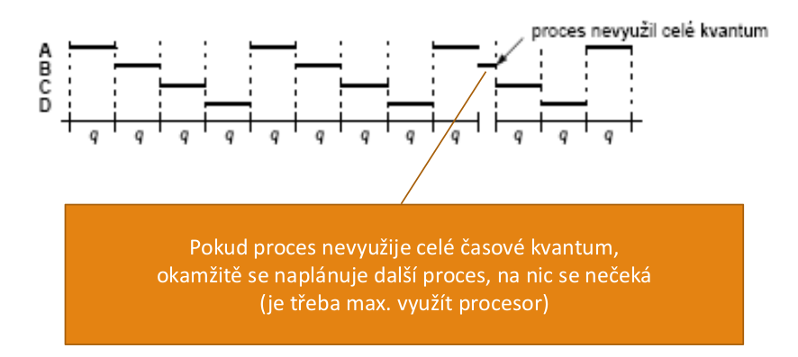

# 26. Plánování procesů v interaktivních systémech
- potřeba docílit, aby proces neběžel "příliš dlouho"
    - možnost obsloužit další procesy - na každého se dostalo
- každý proces - jedinečný a nepredikovatelný
    - nelze říct, jak dlouho poběží, než se zablokuje, jak dlouhý bude CPU burst
- vestavěný systémový časovač v počítači
    - provádí pravidelně přerušení (tiky časovače, clock ticks)
    - vyvolá se obslužný podprogram v jádře
    - rozhodnutí, zda proces bude pokračovat, nebo se spustí jiný (preemptivní plánování) - po několika tikách časovače

## Round Robin (RR)
- algoritmus cyklické obsluhy
- každému procesu přiřazen
    - časový interval = časové kvantum, po které může proces běžet
- proces běží na konci svého kvanta
    - preempce, naplánován a spuštěn další připravený proces
- proces skončí nebo se zablokuje před uplynutím kvanta
    - hned je spuštěn další připravený proces

- jednoduchá implementace plánovače
- plánovač udržuje seznam připravených procesů
    - při vypršení kvanta nebo zablokování nebo ukončení procesu
        - vybere další proces
    . při vypršení kvanta
        - procesu je nedobrovolně odebrán procesor, přejde od stavu _připravený_
    - při zablokování
        - proces žádá I/O, dobrovolně se vzdá CPU, přejde do stavu _blokovaný_
- vhodná délka časového kvanta
    - krátké
        - přepnutí procesů chvíli trvá (uložení a načtení registrů, přemapování paměti,...)
        - pokud by trvalo přepnutí kontextu 1ms, kvantum 4ms - **20% velká režie**
    - dlouhé
        - vyšší efektivita; kvantum 1s - menší režie
        - pokud kvantum delší než průměrná doba držení CPU procesem - preempce je třeba zřídka
        - problém interaktivních procesů - kvantum 1s, 10 uživatelů stiskne klávesu, odezva posledního procesu až 10s
- krátké kvantum - snižuje efektivitu (režie)
- dlouhé - zhoršuje dobu odpovědi na interaktivní požadavky
- je třeb učinit kompromis
- pro algoritmus cyklické obsluhy obvykle 20 až 50ms
- kvantum nemusí být konstantní
    - změna podle zatížení systému
- pro algoritmy, které se lépe vypořádají s interaktivními požadavky lze kvantum delší - 100ms
- problémy
    - v systému výpočetně vázané i I/O vázané úlohy
    - výpočetně vázané - většinou kvantum spotřebují
    - I/O vázné - pouze malá část kvanta se využije a zablokují se 
    - výpočetně vázané získají nespravedlivě vysokou část cpu

## Prioritní plánování
- předpoklad Round Robin, avšak všechny procesy stejně důležité
    - vyšší priorita zákazníkům. kteří si "připlatí"
    - interaktivní procesy vs procesy běžící na pozadí
- prioritu lze přiřadit staticky nebo dynamicky
- staticky
    - při startu procesu, např. Linux příkaz `nice`
- dynamicky
    - přiřadit I/O procesům větší prioritu, použití CPU a zablokování
- priorita = statická + dynamická
    - obsahuje obě složky
    - statická (při startu procesu)
    - dynamická (dle chování procesu v poslední době)
- kdyby pouze statická složka a plánování jen podle priorit - běží pouze připravené s nejvyšší prioritou
- plánovač snižuje dynamickou prioritu běžícího procesu při každém tiku časovače
    - klesne pod prioritu jiného -> přeplánování
### Dynamická priorita
- v kvantově orientovaných plánovacích algoritmech
- dynamická priorita např. dle vzorce _1/f_
- **f** - velikost části kvanta, kterou proces naposledy použil

## Spojení cyklického a prioritního plánování
- **prioritní třídy**   
    - v každé třídě procesy se stejnou prioritou
- **prioritní plánování mezi třídami**
    - bude obsluhována třída s nejvyšší prioritou
- **cyklická obsliha uvnitř třídy**
    - v rámci dané třídy se proesy cyklicky střídají
- obsluhovány jsou pouze připravené procesy v nejvyšší neprázdné prioritní třídě

### Prioritní třídy
- 4 prioritní třídy
- dokud procesy v třídě 3 - spustit cyklicky každý na 1 kvantum
- pokud třída 3 prázdná - obsluhujeme třídu 2
- jednou za čas přepočítání priorit 
- procesům, které využívaly CPU se sníží priorita
- dynamické přiřazování priority
    - dle využití CPU v poslední době
    - priorita procesu
        - snižuje se při běhu
        - zvyšuje při nečinnosti
- cyklické střídání procesů

## Plánovač spravedlivého sdílení
- problém:
    - čas přidělován každému procesu nezávisle
    - pokud uživatel má více procesů než jiný uživatel -> dostane více času celkově
- **spravedlivé sdílení**
    - přidělovat čas každému uživateli (či jinak definované skupině procesů) proporcionálně, bez ohledu na to, kolik má procesů
- máme li _N_ uživatelů, každý dostane _1/N_ času
- nová položka - **priorita skupiny spravedlivého plánování**
    - zavedena pro každého uživatele
- obsah položky
    - započítává se do priority každého procesu uživatele
    - odráží poslední využití procesoru všemi procesy daného uživatele
- _má-li uživatel Pepa procesy p1, p2, p3 a pokud proces p3 bude využívat CPU hodně často, budou touto položkou penalizovány i další procesy uživatele Pepa_
- implementace
    - každý uživatel - položka _g_
    - obsluha přerušení časovače - inkrementuje _g_ uživatele, kterému patří právě běžící proces
    - jednou za sekundu rozklad _g=g/2_
        - aby odrážel chování v poslední době, vzdálená minulost nás nezajímá
    - priorita _P(p, g) = p -g_
    - pokud procesy uživatele využívaly CPU v poslední době - položka _g_ je vysoká, vysoká penalizace

## Plánování pomocí loterie
- cílem poskytnout procesům příslušnou proporci času CPU
- základní princip:
    - procesy obdrží tikety (losy)
    - plánvoač **vybere náhodně** jeden tiket
    - vítězný proces obdrží cenu - 1 kvantum čau CPU
    - důležitější procesy - více tiketů, aby se zvýšila šance na výhru
- spolupracující procesy si mohou předávat losy
    - klient posílá zprávu serveru a blokuje se
    - klient může serveru **propůjčit** všechny své tikety
    - server běží sp rioritou (počtem losů) daného klienta
    - po vykonání požadavku server tikety **vrátí**
    - nejsou-li požadavky server žádné tikety nepotřebuje
- rozdělení času emzi procesy v určitém poměru
    - to bychom těžko realizovali u prioritního plánování
    - co znamená, že jeden proces má prioritu např. 30 a jiný 10
    - proces - množství ticketů - velikost šance vyhrát
- nevýhody
    - není deterministický
    - nemáme zaručeno, že budou naše losy vylosovýny v konečném čase
    - nelze použít tam, kde jsme na determinismu závislí

## Shrnutí

|Algoritmus|Rozhodovací mód|Prioritní funkce|Rozhodovací pravidlo|
|---|---|---|---|
|RR|preemptivní, vyprší kvantum|_P()=1_|cyklicky|
|prioritní|Preemptivní _P jiný > P_| viz text | náhodně, cyklicky|
|spravedlivé|Preemptivní _P jiný > P_|_P(p,g)=p-g_| cyklicky|
|loterie|preemptivní, **vyprší kvant.**|_P()=1_| dle výsledku loterie|

- základem je **round robin**
    - pojem **časové kvantum**
- **prioritní plánování**
    - statická a dynamická složka priority
- spojení **RR** + priority => **prioritní třídy**
- **spravedlivé sdílení**
    - modifikace plánovače pro spravedlnost vůči uživatelům
- **loterie**
    - experimentální, zajímavé vlastnosti
    - nelze použít pro řídící systémy

- **afinita** = na kterých CPU může proces běžet 

