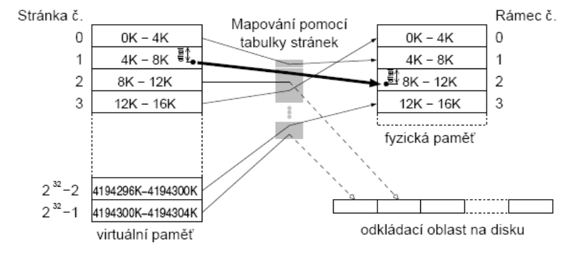
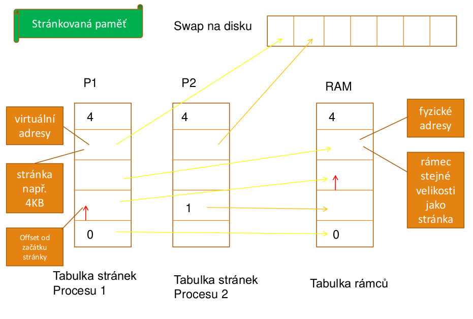
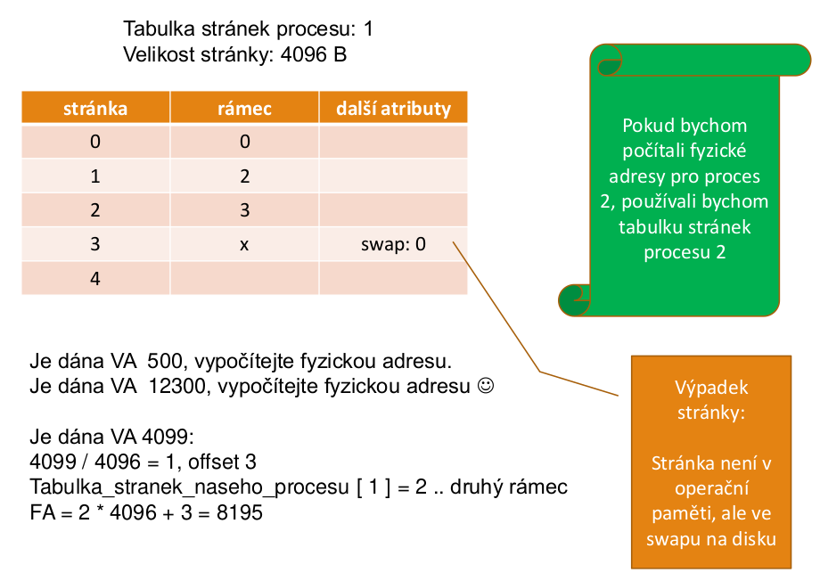
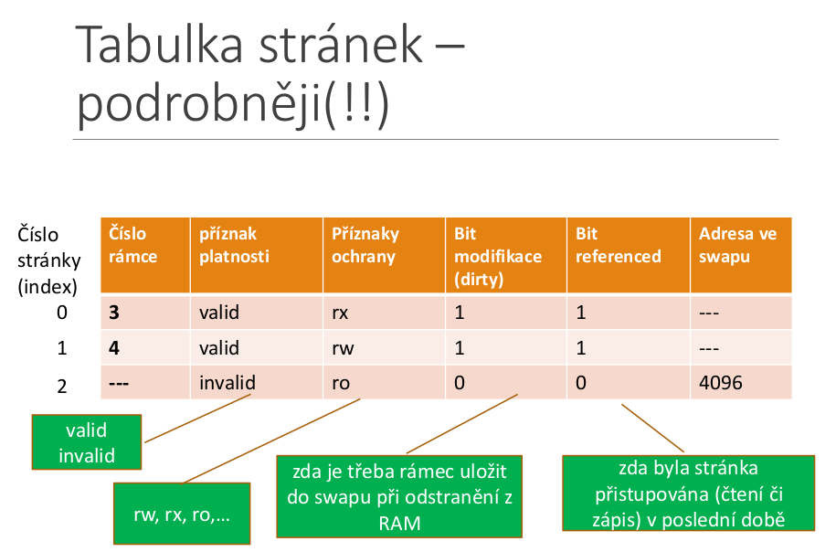

# 27. Správa hlavní paměti, metody přidělování paměti, stránkování, segmentace [KIV/ZOS]

- ideální případ
    - paměť nekonečně velká, rychlá, levná
    - zároveň perzistentní (uchovává obsah po vypnutí napájení)
    - bohužel neexistuje
- hierarchie pamětí (pyramida)
    - registry CPU
    - cache paměť
        - malá, rychlá
    - RAM paměť
        - 4GB, 8GB, dnešní PC
    - pevné disky
        - 1-2TB, pomalé, persistentní SSD vs rotační
-  správce paměti
    - část OS spravující paměť
    - udržuje informaci, které části paměti se používají a které jsou volné
    - alokuje paměť procesům podle potřeby
        - funkce `malloc` v jazyce C
        - `new` v Pascalu
    - zařazuje paměŤ do volné paměti po uvolnění procesem
        - funkce `free` v jazyce C
        - `release` v Pascalu
- příklad alokace
    1. proces bude chtít alokovat 500B, zavolá `malloc`
    2. alokátor koukne, nemá volnou paměť, požádá OS o přidělení stránky paměti (4KB) - `sbrk`
    3. proces je obsloužen, dostane paměť
    4. proces bude chtít dalších 200B, zavolá `malloc`
    5. alokátor už má paměť v zásobě, rovnou ji přidělí procesu
    6. když už proces paměť nepotřebuje, zavolá `free`
- adresa získaná přes `malloc` obsahuje **virtuální adresu**, tj. není to přímo adresa do fyzické paměti RAM
    - virtuální adresa se uvnitř procesoru převede na fyzickou adresu (s využitím tabulky stránek atd.)


## Mechanismy správy pamětí

- od nejjednodušších (program má veškerou paměť) po propracovaná schémata (stránkování se segmentací)
- dvě kategorie
    - **základní mechanismy**
        - program je v paměti po celou dobu svého běhu
    - **mechanismy s odkládáním**
        - programy přesouvány mezi hlavní pamětí a diskem

## Správa paměti - jednoprogramové systémy
- spouštíme pouze jedn program v jednom čase
- uživatel, zadá příkaz, OS zavede program do paměti
- dovoluje použít veškerou paměť, kterou nepotřebuje OS
- po skončení procesu lze spustit další proces
- **tři příklady rozdělení paměti**
    1. OS ve spodní části adresního prostoru v RAM (minipočítače)
    2. OS v horní části adresního prostoru v ROM
    3. OS v RAM, výchozí obslužné rutiny v ROM
## Multiprogramování s pevným přidělením paměti
- paralelní nebo pseudoparalelní běh více programů = multiprogramování
- práce více uživatelů, maximalizace využití CPU apod.
- nejjednodušší schéma - **rozdělit paměť na _n_ oblastí** (i různé velikosti)
    - v historických systémech - rozdělení ručně při startu stroje
    - po načtení úlohy do oblasti je obvykle část oblasti nevyužitá
    - snaha umístit úlohu do nejmenší oblasti, do které se vejde
## Pevné rozdělení sekcí
1. více front, každá úloha do nejmenší oblasti, kam se vejde
2. jedna pronta - po uvolnění oblasti z fronty vybrat největší úlohu, která se veje (**tj. není FIFO**)


- **strategie 1**
    - může se stát, že existuje neprázdná oblast, která se nevyužije, protože úlohy čekají na jiné oblasti
- **strategie 2**
    - diskriminuje malé úlohy (vybíráme největší co se vejde), malým bychom měli obvykle poskytnout nejlepší službu
- řešení - mít vždy malou oblast, kde poběží malé úlohy
- řešení - s každou úloho ve frontě sdružit "čítač přeskočení", bude zvětšen při každém přeskočení úlohy
- po dosažení mezní hodnoty už nesmí být úloha přeskočena

## Multiprogramování s proměnnou velikostí oblastí
- úloze je přidělena paměť dle požadavku
- v čase se mění
    - počet oblastí
    - velikost oblastí
    - umístění oblastí
- zlepšuje využití paměti
- komplikovanější alokace/dealokace

## Problém mnoha volných oblastí
- může vzniknout mnoho volných oblastí (děr)
    - paměť se "rozdrobí"
- **kompaktace paměti**
    - přesunout procesy směrem dolů
    - drahá operace
    - neprovádí se bez speciálního HW

## Správa pomocí bitových map
- pamět rozědlíme pomocí bitových map (B až KB)
- s každou jednotkou 1 bit (volno X obsazeno)
    - `0` - blok je volný
    - `1` - blok je obsazený
- menší alokační jednotky - více nevyužité paměti
- alokační jednotka 4 byty (32 bitů)
    - na každých 32 bitů paměti potřebuejem 1bit signalizační, tedy 1/33 paměti
- výhoda: **konstantní velikost bitové mapy**
- nevýhoda: **najít požadovaný úsek _N_ volných jednotek**
    - náročné, příliš často se nepoužívá pro RAM
    - ale používá se pro určení volných bloků, volných i-uzlů na disku atd.

## Správa pomocí seznamů
- seznam alokovaných a volných oblastí
- položka seznamu
    - info o typu - proces nebo díra
    - počáteční adresa oblasti
    - délka oblasti
- práce se seznamem
    - proces skončí - P se nahradí H (dírou)
    - dvě H vedle sebe - **sloučí se**
- seznam seřazený podle počáteční adresy oblasti
- může být obousměrně vázaný seznam
    -. snadno k předchozí položce
- jak prohledávat seznam, když proces potřebuje alokovat paměť?

## Alokace - first fit, next fit
- **first fit** (první vhodná)
    - prohledávání od začátku, dokud se nenajde **dostatečně velká** díra
    - díra se rozdělí na část pro proces a nepoužitou oblast (většinou "nesedne" přesně)
    - rychlý, prohledává co nejméně
- **next fit** (další vhodná)
    - prohledávání začne tam, kde skončilo předchozí
    - o málo horší než _first fit_

## Alokace - best fit

- **best fit** (nejmenší/ nejlepší vhodná)
    - prohlédne celý seznam, vezme nejmenší díru., do které se proces vejde
    - pomalejší - prochází celý seznam
    - více ztracené paměti, než FF, NF - zaplňuje paměť malými nepoužitelnými dírami
- **worst fit** (největší díra) - není vhodné
    - nepoužívá se 

## Alokace - quick fit
- samostatné seznamy děr nejčastěji požadovaných délek
- díry velikosti 4KB, 8KB
- ostastní velikosti v samostatném seznamu
- alokace rychlá
- dealokace - obtížné sdružování sousedů

## Mechanismus stránkování (paging)
- program používá virtuální adresy
- musíme rychle zjistit, zda je požadovaná adresa v paměti
    - ANO - převod VA => FA
    - NE - je třeba zavést z disku do paměti
- co nejrychlejší => děje se při každém přístupu do paměti
- **VAP** - stránky (pages) pevné délky
    - nejčastějí **4KB**, další běžné: **2MB**, **4MB** a **1GB**
- **fyzická paměť - rámce** (page frames) stejné délky
- rámec může obsahovat **PRÁVĚ JEDNU** stránku
- na známém místě v paměti - **tabulka stránek**
    - hodnota registru CR3 CPU ukazuje na tabulku stránek
- **tabulka stránek poskytuje mapování virtuálních stránek na rámce**
 **virtuální adresní prostor**
    - každá proces má k dispozici prostor v rozsahu _0..2^p - 1_ bytů
    - _p_ => počet bitů ukazatele, např. 32 bitů
- mapování virtuální stránky -> fyzické rámce je pro proces transparentní
- procesy používají **VA**

- **MMU - Memory Management Unit**
    - je mezi CPU a pamětí
    - jednotka správy paměti
    - MMU převádí virtuální na fyzické adresy
    - nachází se uvnitř procesoru, po pinech sběrnice jdou fyzické adresy

    

    - pokud program nějakou dobu běží
        - v cache jeho data a instrukce -> dobrá výkonnost
    - při přepnutí na jiný proces
        - převažuje přístup do hlavní paměti
    - nastavení MMU se musí změnit
    - přepnutí mezi úlohami i přepnutí do jádra (volání služby OS) - relativně drahé (čas)

- stránky jsou mapovány na rámce v RAM, nebo jsou uložené v odkládací paměti na disku
- **každý proces má svojí tabulku stránek**









- **číslo rámce**
    - udává, ve kterém rámci v RAM je stránka uložena
- **příznak platnosti**
    - říká, zda je daná stránka v RAM nebo není (Present/absent bit)
    - v některých systémech - 2 bity (present/absent zda se vůbec používá a druhý bit zda je v RAM nebo není, Intel používá jeden bit při page fault a řeší se co dále (je ve swapu, není vůbec, ...)
- **příznak ochrany**
    - zda je stránka jen pro čtení, nebo i pro zápis (případně lze z ní vykonávat kód)
- **bit modifikace**
    - pokud stránka byla modifikována (zápis), znamená to, že pokud je i ve swapu, tak tam je nyní neaktuální - při odložení z paměti do swapu je třeba znovu zapsat
- **bit referenced**
    - zda byla stránka v nedávné době přistupována či ne
    - slouží pro page replacement algoritmy (nevyhodit z RAM stránku, co byla nedávno použitá)
- případně další údaje:
    - **bit caching**
        - povolení/zákaz kešovaní dané stránky
    - **adresa ve swapu**
        - někde musí být uložena informace, jakou danou stránku ve swapu najít
- **tabulka stránek**
    - součástí PCB
        - **PCB** obsahuje info, kde leží jeho tabulka stránek
    -  velikost záznam
- **příklad výpočtu**
    - je dána `VA(p1) = 100`, určete _FA_
    - velikost stránky jsou 4KB (4096 bytů)
    - tabulka stránek procesu _p1_ následující:

        |Číslo stránky|rámec|
        |---|---|
        |0|1|
        |1|2|
        |2|-|
        |3|0|
    - postup výpočtu:
        1. virtuální adresu rozdělíme na číslo stránky a offset
            - `str = VA div 4096` (celočíselné dělení, 4096 je velikost stránky)
            - `offset = VA mod 4096` (zbytek po dělení)
        2. převod pomocí tabulky stránek
            ```
            tab_str[0] = 1 (pro stránku 0 je číslo rámce 1)
            tab_str[1] = 2
            tab_str[2] = -- (stránka není namapována)
            tab_str[3] = 0
            ```
            - pro `VA = 100` je stránka `0`, offset `100` => **tedy rámec 1**
        3. z čísla rámce a offsetu sestavíme fyzickou adresu
            ```
            FA = ramec * 4096 + offset
            FA = 1 * 4096 + 100
            FA = 4196 (máme fyzickou adresu) 
            ```
            - v reálném systému dělení znamená rozdělení na vyšší a nižší bity adresy (proto mocnina dvou velikost str.)
                - nižší bity - offset
                - vyšší bity - číslo stránky
- náročnost:
    - velký rozhsah tabulky stránek
        - např. 1 milion stránek, ne všechny obsazeny
    - rychlý přístup
        - nemůžeme pokaždé přistupovat k tabulce stránek
        - různá HW řešení, kopie části tabulky v MMU -> **TLB cache**
- **vnější fragmentace** (zůstávají nepřidělitelné úseky paměti) při stránkování nenastává, všechny stránky jsou přidělitelné (jsou stejně velké)
- **vnitřní fragmentace**
    - část přidělené oblasti je **nevyužita** (dostaneme přidělenou stránku, ale využijeme z ní jen část)
    - při stránkování vnitřní fragmentace **nastává**
        - v průměru polovina poslední stránky procesu je prázdná
- **čisté stránkování** => bez odkládací oblasti (swapu)
    - avšak nejčastěji se používá stránkování s využitím swapu
- **OS udržuje**
    - 1 tabulka rámců
    - tabulku stránek pro každý proces

    


### Výpadek stránky
- viz příklad, pro adresu 8192, str 2, offset 0
- stránka není mapována
- výpadek stránky způsobí vyjímku, zachycena OS (pomocí přerušení)
- OS **iniciuje zavádění** stránky a **přepne na jiný** proces
- po zavedení stránky OS upraví mapování (tabulku stránek)
- proces může pokračovat
- vyřešit: KAM stránku zavést a ODKUD?
- pokud daná stránka procesu není na určitý rámec ve fyzické paměti a chceme k ní přistoupit
- dojde k **výpadu stránky** - vyvolání přerušení operačního systému
- operační systém se postará o to, aby danou stránk u zavedl do nějakého rámce ve fyzické paměti, nastavil mapování a poté může přístup proběhnout

### Tabulka rámců
- pro správu fyzické paměti RAM
- je třebga informace, které rámce jsou volné a obsazené
- mapuje číslo stránky na číslo fyzického rámce
- další informace jako např. příznaky ochrany
- řeší problémy relokace a ochrany
    - relokace - mapování VA na FA
    - ochrana - v tabulce stránek uvedeny **pouze** stránky, ke kterým má proces **přístup** (jinam se nedostane)
- přepnutí na jiný proces 
    - MMU přepne na jinou tabulku stránek

### Velikost tabulky stránek
- VA 32 bitů
    - 12 bitů offset (pozice ve stránce - stránka 4KB)
    - 20 bitů číslo stránky
        - stránek je 2^20 (cca přes milion)
        - každá položka zabírá 4B .. (2^20)*4B=4MB zabírá pro **každý** proces
    - proces využívá jen část prostoru VA
        - kód
        - data (inicializovaná, a neinicializovaná)
        - sdílené knihovny a jejich data
    - od nejvyšší adresy zásobník - roste dolů

### TLB
- problém:
    - každý přístup do paměti - sáhne do tabulky stránek
        - 2x více paměťových přístupů
        - musíme sáhnout do tabulky stránek a pak do paměti kam chceme
- tento problém TLB řeší
- jedná se o HW cache
- přepnutí kontextu na jiný proces
    - problém - vymazání cache
    - než se TLB opět zaplní - pomalý přístup
- optimalizuje rychlost převodu VA na FA

### Invertovaná tabulka stránek
- položky pro každý **fyzický rámec**
    - omezený počet - dán velikostí RAM
    - VA 64bitů, 4KB stránky, 256MB RAM - 65536

### Stránkování na žádost
- vytvoření procesu
    - vytvoří prázdnou tabulku stránek
    - alokace místa na disku pro odkládání stránek
    - některé implementace - odkládací oblast inicializuje kódem programu a daty ze spustitelného souboru
- při běhu
    - žádná stránka v paměti
    - 1. přístup =>  **výpadek stránky (page fault)**
    - OS zavede požadovanou stránku do paměti
    - postupně se v paměti vytvoří tzv. **pracovní množina** stránek
- má-li proces svou **pracovní množinu stránek** v paměti, může pracovat bez mnoha výpadků
- pracovní množina stránek daného procesu - kolik stránek mjsí mít ve fyzické paměti, aby mohl nějaký čas pracovat bez výpadků stránky


## Segmentace
- spousta věcí podobných jako přidělování paměti po sekcích, ale rozdíl:
    - po sekcích - procesy
    - segmenty - pro části procesu
- stejné problémy jako přidělování paměti po sekcích
    - externí fragmentace paměti
    - mohou zůstávat malé díry
- **segmentace na žádost**
    - segment - **zavedený** v paměti nebo odložený na disku
- adresování segmentu co není v paměti - výpadek segmentu - zavede do paměti - není-li místo - jiný segment odložen na disk
- HW podpora - bity v tabulce segmentů
    - bit segment je zaveden v paměti
    - bit referenced
- **segmentace se stránkováním**
    - velké segmenty - nepraktické celé udržovat v paměti
- stránkování segmentů
    - v paměti pouze potřebné stránky

