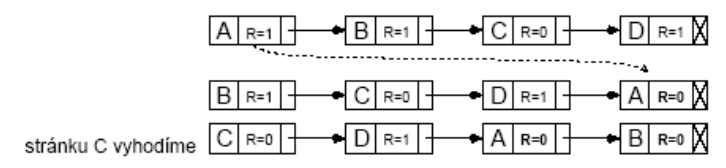

# 28. Algoritmy nahrazování stránek paměti, Beladyho anomálie, PFF, trashing

## Algoritmy nahrazování stránek paměti
- uvolnit rámec pro stránku, ale co s původní stránkou?
- pokud byla stránka modifikována (dirty=1), uložit na disk
- pokud modifikovaná nebyla a má již stejnou kopii na disku (swap), pouze uvolnit

### Algoritmus FIFO
- udržovat seznam stránek v pořadí, ve kterém byly zavedeny
- vyhazujeme nejstarší stránku (nejdéle zavedenou - první na seznamu)
- není nejvhodnější
- často používané stránky mohou být v paměti dlouho (analogie s obchodem, nejdéle zavedený výrobek - chleba)
- trpí **Beladyho anomálií**

### Algoritmus MIN/OPT
- optimální - **nejmenší možný** výpadek stránek
- _vyhodíme zboží, které nejdelší dobu nikdo nebude potřebovat_
- stránka označena počtem instrukcí, po který se k ní nebude přistupovat
_
- `p[0] = 5, p[1] = 20, p[3] = 100`
- výpadek stránky - vybere s nejvyšším označením
- vybere se stránka, která bude zapotřebí nejpozději v **budoucnosti**
- bohužel **není realizovatelný** 
    - jak bychom zjistili dopředu, která stránka bude potřeba?
- algoritmus pouze pro srovnání s realizovatelnými
- použití pro běh programu v simulátoru

### Least Recently Used (LRU)
- **nejdéle nepoužitá** (pohled do minulosti)
- princip lokality
    - stránky používané v posledních instrukcích se budou pravděpodobně používat i v následujících
    - pokud se stránka dlouho nepoužívalam, pravděpodobně nebude brzy zapotřebí
- _vyhazovat zboží, na kterém je v prodejně nejvíce prachu = nejdéle nebylo požadováno_- obtížná implementace
- **SW řešení** (není použitelné)
    - seznam stránek v pořadí referencí
    - výpadek - vyhození stránky ze začátku seznamu
    - zpomalení cca 10x, nutná podpora HW
- **HW řešení**
    - **čítač**
        - MMU obsahuje čítač (64bit), při každém přístupu do paměti zvětšen
        - každá položka v tabulce stránek - pole pro uložení čítače
        - odkaz do paměti
            - obsah čítače se zapíše do položky pro odkazovanou stránku
        - výpadek stránky
            - vyhodí se stránka s nejnižším číslem
    - **matice**
        - MMU udržuje **matici n\*n bitů**
            - _n_ - počet rámců
        - všechny prvky _0_
        - **odkaz na stránku** odpovídající k-tému rámci
            - všechny bity k-tého **řádku** matice na _1_
            - všechny bity k-tého **sloupce** matice na _0_
        - **řádek** s nejnižší binární hodnotou
            - nejdéle nepoužitá stránka

- **výhody**
    - z časově založených (realizovatelných) nejlepší
    - Beladyho anomálie nemůže nastat
- **nevýhody**
    - každý odkaz na stránku - aktualizace záznamu (zpomalení)
        - položka v tab. stránek
        - řádek a sloupec v matici
- LRU se pro stránkovanou virtuální paměť příliš nepoužívá
- LRU ale např. pro blokovou cache souborů

### Not Recently Used (NRU)
- snaha vyhazovat **nepoužíváné stránky**
- HW podpora:
    - **stavové bity** Referenced (R) a Dirty (M = modified)
    - v tabulce stránek
- bity **nastavované HW** dle způsobu přístupu ke stránce
- **bit R** - nastaven na _1_ při **čtení** nebo **zápisu** do stránky
    - pravidelně nulován (aby označoval referenci v poslední době)
- **bit M** - na _1_ při **zápisu** do stránky
    - stránku je třeba při vyhození zapsat na disk
    - bit **zůstane** na _1_, dokud ho SW nenastaví zpět na _0_
- algo:
    - začátek - všechny stránky `R=0`, `M=0`
    - bit **R** nastavován OS **periodicky** na _0_ (přerušení čas.)
        - odliší stránky referencované v poslední době
    - **4 kategorie stránek (R, M)**
        - **třída 0** `R=0`, `M=0` 
        - **třída 1** `R=0`, `M=1` => z třídy **3** po nulování **R**
        - **třída 2** `R=1`, `M=0` 
        - **třída 3** `R=1`, `M=1` 
- NRU vyhodí **stránku z nejnižší neprázdné třídy**
- výběr mezi stránkami ve stejné třídě je náhodný
- platí:
    - _je lepší vyhodit **modifikovanou** stránku, která **nebyla použita** 1 tik, než nemodifikovanou stránku, která se právě používá_
- výhody
    - jednoduchost, srozumitelnost
    - efektivně implementované
- nevýhody
    - výkonnost (jsou i lepší algoritmy)

### Second Chance
- vycházejí z FIFO
- _evidovat, jestli zboží v poslední době někdo koupi (ano - prohlásíme za čerstvé zboží)_ 
- modifikace FIFO - zabránit vyhození často používané stránky
- algo:
    - dle bitu R (referenced) nejstarší stránky
        - `R=0` -> stránka je nejstarší, nepoužívaná - vyhodíme
        - `R=1` -> nastavíme `R=0` přesuneme na konec seznamu stránek (jako by byla nově zavedena)

1. nejstarší je _A_, má `R=1` -> nastavíme _R_ na `0` a přesuneme na konec seznamu
2. druhá nejstarší je _B_ má `R=1` -> nastavíme _R_ na `0` a přesuneme na konec seznamu
3. nejstarší je _C_, má `R=0` -> vyhodíme jí

- SC vyhledá **nejstarší stránku**, která **nebyla referencována v poslední době**
- pokud všechny referencovány - **čisté FIFO**
    - všem se postupně nastaví _R_ na `0` a na konec seznamu
    - dostaneme se opět na _A_, nyní s `R=0`, vyhodíme jí
- algoritmus končí nejvýše po (počet rámců + 1) krocích

### Clock
- optimalizace datových struktur Second Chance
    - stránky udržovány v **kruhovém** seznamu
    - ukazatel na nejstarší stránku - _ručička hodin_
- výpadek stránky - najít stránku k vyhození
- stránka kam ukazuje ručička
    - má-li `R=0`, **stránku vyhodíme** a ručičku posuneme o jednu pozici
    - má-li `R=1`, **nastaívme R na 0**m ručičku posuneme o 1 pozici, opakování,...
- od SC se liší pouze implementací
- Varianty Clock používají např. BSD UNIX

### Aging
- SW aproximace LRU
- algo:
    - každá položka tabulky stránek - pole stáří (age), _N_ bitů (8)
    - na počátku `age=0`
    - při každém přerušení časovače pro **každou stránku**
        - posun pole stáří o 1 bit vpravo
        - zleva se přidá hodnota bitu _R_
        - nastavení _R_ na `0`
    - při výpadku se vyhodí stránka, jejíž pole má **nejnižší hodnotu**

- několik stránek může mít stejnou hodnotu age, a nevíme která byla odkazována **dříve** (u LRU jasné vždy) - hrubé rozlišení (po ticích časovače)

- age se může snížit na 0
    - nevíme, zda odkazována před 9ti nebo 1000ci tiky časovače
    - uchovává pouze **omezenou historii**
- stránky se stejnou hodnotou `age` - vybereme náhodně

## Beladyho anomálie
- obecný předpoklad
    - _pokud budeme mít více rámců paměti, tím méně nastane výpadků_
- Belady našel příklad pro **algoritmus FIFO**, kdy to neplatí
- pro řětezec odkazů: `0 1 2 3 0 1 4 0 1 2 3 4`

- tj. pro 3 rámce nastane 9 výpadků a pro 4 rámce 10 výpadků
    - se zvýšením počtu rámců se zvýšil i počet výpadků paměti
- objev Beladyho anomálie způsobil vývoj teorie stránkovacích algoritmů a jejich vlastností

## PFF
- frekvence výpadků stránek za jednotku času
    - pro většinu rozumných algoritmů se PFF snižuje s množstvím přidělených ramců
- příliš vysoké?
    - zvýšíme počet rámců
- příliš nízké?
    - snížíme počet rámců
    - proces má asi zbytečně příliš paměti 

## Trashing
- proces pro svůj rozumný běh potřebuje **pracovní množinu stránek**
- pokud se pracovní množiny stránek aktivních procesů **nevejdou** do paměti, tak nastane **zahlcení** (trashing)
    - v procesu nastane výpadek stránky
    - paměť je plná (není volný rámec) - je třeba nějakou stránku vyhodit
    - stránka pro vyhození bude ale brzo zapotřebí, bude se muset vyhodit jiná používaná stránka
- uživatel pozoruje - systém intenzivně pracuje s diskem a běh procesů se řádově zpomalí (víc času stránkování než běh)
- trashing lze detekovat pomocí PFF
- řešení
    - při zahlcení snížit úroveň multiprogramovíní 
