# 29. Ovládání periferních zařízení, RAID. Systémy souborů. [KIV/ZOS]
## Ovládání periferních zařízení
- modul pro správu I/O
- vývoj rozhraní mezi CPU a zařízeními:
    1. CPU řídí přímo periferii
    2. CPU - řadič - periferie
    3. řadič umí vyvolat přerušení
    4. řadič umí DMA
    5. I/O modul
    6. I/O modul s vlastní pamětí
- principy I/O software: (**důležité**)
    1. obsluha přerušení (nejnižší úroveň v OS)
    2. ovladač zařízení
    3. SW vrstva OS nezávislá na zařízení
    4. uživatelský I/O SW

### 1. CPU řídí přímo periferii
- CPU přímo vydává potřebné signály
- CPU dekóduje signály poskytované zařízením
- nejjednodušší HW
- nejméně efektivní využití CPU
- jen v jednoduchých mikroprocesorem řízených zařízeních (dálkové ovládání televize)
- používá **vyhrazené adresy**
- nazývá se _paměťově mapované I/O_
- HW musí pro dané adresy umět **vypnout cachování**
- danou oblast můžeme namapovat do virtuálního adresního prostoru nějakého procesu (zpřístupnění I/O zařízení) 

### 2. CPU - řadič - periferie
- **řadič (device controller)**
    - převádí příkazy CPU na elektrické impulzy pro zařízení
    - poskytuje CPU info o stavu zařízení
    - komunikace s CPU pomocí **registrů** řadiče na známých I/O adresách
    - HW buffer pro alespoň 1 záznam (blok, znak, řádka)
    - rozhraní řadič-periférie může být standardizováno (SCSI, IDE, ...)
- pojmy:
    - povel => příkaz, který dává CPU řadiči
    - stav => informace o stavu, např. přenos OK
    - data => buffer na předávaná data
- příklad operace zápisu
    - CPU zapíše data do bufferu
        - informuje řadič o požadované operaci
    - po dokončení výstupu zařízení nastaví příznak, který může CPU otestovat
    - pokud přenos dopadl dobře, může vložit další data
    - CPU musí dělat všechno (programové I/O)
    - významnou část času stráví CPU **čekáním na dokončení I/O operace**

### 3. Řadič umí vyvolat přerušení
- CPU nemusí testovat příznak dokončení
- při dokončení I/O vyvolá řadič **přerušení**
- CPU začne obsluhovat přerušení
    - obslužná procedura přerušení (provádí instrukce na předdefinovaném místě)
    - určí co dál
- postačuje pro pomalá zařízení, např. sériové I/O

### 4. Řadič může přistupovat k paměti pomocí DMA
- DMA přenosy mezi pamětí a I/O zařízením
- CPU inicializuje přenos, ale sám ho nevykonává
- řadič DMA - speciální obvod, zajišťuje blokové přenosy mezi I/O zařízením a pamětí
- postup:
    1. CPU zadá požadavek řadiči DMA (adresu I/O zařízení, adresu v RAM, počet bytů)
    2. DMA obvod provede přesun dat bez zásahu CPU
    3. CPU se zatím může věnovat dalším věcem (ale je omezen ve využití sběrnice)
    4. Po ukončení přenosu DMA obvod vyvolá přerušení
- **bus mastering**
    - zařízení převezme kontrolu nad sběrnicí a přenos provede samo (PCI sběrnice)
    - vhodné pro rychlá zařízení - řadič disků, síťová karta, zvuková karta, grafická karta atd.
- **DMA** (Direct Memory Access)

### 5. I/O modul umí interpretovat speciální I/O programy
- I/O procesor
- interpretuje programy v hlavní paměti (RAM)
- CPU spustí I/O procesor
    - I/O procesor provádí své instrukce samostatně

### 6. I/O modul s vlastní pamětí
- I/O modul provádí programy
- má vlastní paměť
    - je vlastně samostatným počítačem
- složité a časově náročné operace
    - grafika, šifrování, ...

### Kanálová architektura k 5, 6

### Komunikace CPU s řadičem
- odlišné prostory  (I/O prostor)
    - CPU zapisuje do registrů řadiče pomocí speciálních I/O instrukcí
    - vstup: **IN** R, port
    - výstup: **OUT** R, port
- 1 adresní prostor (RAM)
- hybridní schéma (I/O, RAM)
    - řídící registry
        - přístup pomocí I/O instrukcí (instrukce IN, OUT)
    - HW buffer
        - mapován do paměti (RAM)
    - např. na PC
        - buffery mapovány do oblasti 640K až 1MB
- **IN, OUT jsou privilegované instrukce**
- mezi privilegované instrukce dále patří
    - řízení CPU
    - zákaz přerušení
    - práce se speciálními registry
    - **práce se vstupními a výstupními zařízeními**
    - nastavení a mapování paměti

### 1. Obsluha přerušení
- řadič vyvolá přerušení ve chvíli **dokončení** I/O požadavku
- snaha, aby se přerušením nemusely zabývat vyšší vrstvy
- ovladač žádá I/O požadavek, **usne** - P(sem)
- po příchodu přerušení ho obsluha přerušení **vzbudí** - V(sem)
- časově kritická oblsuha přerušení - co nejkratší

### 2. Ovladače zařízení
- obsahují veškerý kód **závislý na konkrétním I/O zařízení** (např. ovladač zvukovky od daného výrobce)
- ovladač jako jediný zná HW podrobnosti
    - způsob komunikace s řadičem zařízení
    - zná detaily - např. ví o sektorech a stopách na disku, pohybech diskového ramena, start&stop motoru
- může ovládat všechna zařízení daného druhu nebo třídu příbuzných zařízení
    - např. ovladač SCSI disků - všechny SCSI disky
- ovladače často vytvářejí výrobci HW
    - dobře definované rozhraní mezi OS a ovladači
- ovladače podobných zařízení - stejná rozhraní
    - např. síťové karty, zvukové karty

#### Funkce ovladače zařízení
1. ovladači předán příkaz od vyšší vrstvy
    - např. **zapiš data do bloku n**
2. nový požadavek **zařazen do fronty**
    - může ještě obsluhovat předchozí
3. ovladač zádá **příkazy řadiči** (požadavek přijde na řadu)
    - např. nastavení hlavy, přečtení sektoru
4. **zablokuje se do vykonání** požadavku
    - neblokuje při rychlých operacích - např. zápis do registru
5. **vzbuzení** obsluhuje přerušení (dokončení operace)
    - zkontroluje, zda nenastala chyba
6. pokud OK, předá výsledek (status + data) vyšší vrstvě
    - status - datová struktura pro hlášení chyb
7. zpracuje další požadavky ve frontě
    - jeden vybere a spustí

#### Problémy s ovladači
- chyba ovladače - pád systému
    - běh v privilegovaném režimu (jádře)
    - chyba v ovladači může způsobit pád systému
- ovladač pro určitý HW i určitý OS
    - můžete mít starší webkameru s ovladačem pro Windows XP, ale třeba nebude použitelná ve Windows 8.1

### 3. SW vrstva OS nezávislá na zařízení
- I/O funkce **společné pro všechna zařízení daného druhu**
    - např. společné fce pro všechna bloková zařízení
- definuje rozhraní s ovladači
- poskytuje jednotné rozhraní uživatelskému SW
- **často špatně pochopená**
- **poskytované funkce**
    - pojmenování zařízení
        - LPT1, COM1 (paralelní a sériový port), `/dev/lp0`
    - ochrana zařízení
        - přístupová práva
    - alokace a uvolnění vyhrazených zařízení
        - v 1 chvíli použitelná pouze jedním procesem
        - např. tiskárna, plotter, magnetická páska
    - vyrovnávací paměti
        - bloková zařízení - bloky pevné délky
        - pomalá zařízení - čtení/zápis s využitím bufferu
    - hlášení chyb
    - jednotná velikost bloku pro bloková zařízení
    - v moderních OS se zařízení jeví jako objekty v souborovém systému (v mnoha OS je tato vrstva součástí logického souborového systému)

### 4. I/O SW v uživatelském režimu
- programátor používá v programech **I/O funkce** nebo **příkazy** jazyka
    - např. `printf` v C, `writeln` v Pascalu
    - knihovné sestavené s programem
    - formátovnání - `printf("%.2d%.2d\n", hodin, minut)`
    - často vlastní vyrovnávací paměť na jeden blok
- **spooling**
    - implementován pomocí procesů běžících v uživ. režimu
    - způsob obsluhy vyhrazených I/O zařízeními (mutliprogramování)
    - např. proces aby lokoval zhařízení a pak hodinu nic nedělal
- příklad z UNIXu
    - přístup k fyzické tiskárně - pouze 1 speciální proces
        - daemon `lpd`
    - proces vygeneruje celý soubor, `lpd` ho vytiskne
    - proces chce tisknout, sputí `lpr` a naváže s ním komunikaci
    - proces předává tisknutá data programu `lpr`
    - `lpr` zapíše data do souboru v určeném adresáři
        - spooling directory - přístup jen `lpr` a `lpd`
    - dokončení zápisu - `lpr` oznámí `lpd`, že soubor je připraven k vytisknutí, `lpd` soubor vytiskne a zruší

## RAID
- **R**edundant **A**rray of **Independent** **Disks**
- rotační disky
    - doba vystavení + rotační zpoždění
    - stopa, sektor
- SSD disky
    - dražší, menší kapacita
    - nemá pohyblivé části
    - rychlá přístupová doba
    - může číst a zapisovat jednotlivé bajty
    - ale musí vymazat celáý blok, než do něj zapíše
    - omezený počet cyklů mazání zápisu
- MIX
    - SSD disk v kombinaci s rotačním diskem
- důvod použití RAIDu
    - pevný disk
        - elektronická část + mechanická
        - **náchylnost k poruchám**
        - cena dat >> cena HW
    - odstávka při výměně zařízení, přenos dat ze zálohy
    - větší disková kapacita než 1 disk
- data jsou distribuována na více disků
- datové operace jsou realizované paralelně
- kromě distribuování dat na více disků zvýšení spolehlivosti (mimo RAID 0) - redundance informace (zdvojení disků nebo parita)
- sada fyzických disků, OS je následně vidí jako jeden disk
- používané úrovně
    - RAID 0, 1, 5
    - RAID 10 => kombinace 0 a 1
    - RAID 6 => zdvojená parita
- pojmy:
    - SW nebo HW raid
    - hot plug
    - hot spare
    - degradovaný režim - jeden (či více dle typu RAIDu) z disků v poli je porouchaný, ale RAID stále funguje

### RAID 0
- dva režimy:
    - **zřetězení**
        - data postupně ukládána na několik disků
        - zaplní se první disk, pak druhý, atd.
        - snadné zvětšení kapacity, při poruše disku ztratíme jen část dat

    - **prokládání**
        - data ukládána na disky cyklicky po blocích
        - při poruše jednoho z disků přijde o data
        - větší rychlost čtení/zápisu
            - jeden blok z jednoho disku, druhý blok z druhého disku
        - 

### RAID 1
- mirroring => zrcadlení
- na 2 disky stejných kapacit totožné informace
- výpadek 1 disku => nevadí
- jednoduchá implementace => často SW
- nevýhoda - využijeme jen polovinu kapacity
- zápis - pomalejší (stejná data na 2 disky)
    - ovlivněn diskem na němž bude trvat déle
- čtení - rychlejší
    - řadič => lze střídat požadavky mezi disky 

### RAID 5
- redundantní pole s distribuovanou paritou
- minimálně 3 disky
- režie: 1 disk z pole n disků
    - 5 disků 100GB: 400GB pro data
- výpadek 1 disku nevadí
- čtení - výkon OK
- zápis - pomalejší
    - zápis - čtení starších dat, čtení staré parity, výpočet nové parity, zápis nových dat, nové parity

- nejpoužívanější
- detekce poruchy v diskovém poli
- hot spare disk
- použití hot plug disků

### RAID 6
- RAID 5 + navíc další paritní disk
- odolné proti výpadku dvou disků
- rychlost čtení srovnatelná s RAID 5
- zápis pomalejší

### RAID 10
- kombinace RAID 0 (stripe) a RAID 1 (zrcadlo)
- min. počet disků 4
- režie 100% diskové kapacity navíc
- vyšší výkon v bezpečných typech polích
- podstatně rychlejší než RAID 5, při zápisu
- odolnost proti ztrátě až 50% disků x RAID 5

### RAID 50

### RAID 2
- data **po bitech** stripována mezi jednotlivé disky
- zabezpečení hammingovým kódem

### RAID 3
- _N+1_ disků bitové prokládání
- na _N_ data, poslední disk XOR parita

### RAID 4
- disky stripovány po blocích, ne po bitech
- každý disk je nezávislý
- parita je po blocích

### HOT SPARE DISK
- záložní disk okamžitě připravený k nahrazení vadného disku
- při výpadku disku v poli automaticky aktivován hot spare disk a dopočítaná data
- minimalizace rizika (časové okno)
    - pole je degradované a je třeba vyměnit disk
    - administrátor nemusí být poblíž
- hot spare disk lze sdílet mezi více RAIDy

### HOT PLUG
- snadná výměna disku za běhu systému
- není třeba vypnout server pro výměnu disku
- "šuplera z přední strany serveru"

## Systémy souborů
- potřeba aplikací trvale uchovávat data
- hlavní požadavky
    - možnost uložit velké množství dat
    - potřeba uchovávát strukturovaně => adresářový podstrom a soubory
    - informace zachována i po ukončení procesu
    - data přístupná více procesům
- **společné problémy** při přístupu k zařízení
    - alokace prostoru na disku
    - pojmenování dat
    - ochrana před neoprávněným přístupem
    - zotavení po havárii (výpadek napájení)
- soubor je pojmenovaná množina souvisejících informací, uložená na datovém médiu, se kterou lze pracovat nástroji operačního systému jako s jedním celkem
- soubor:
    - název
    - velikost v bytech
    - datový obsah
- příklad souboru:
    - název: `bakalarka.pdf`
    - velikost v bytech: `1 852 457 B`
    - časové značky (vytvoření, změny, případně posledního přístupu)
    - přístupová práva (žádná, základní unixová, ACL)
    - datový obsah (rozumí mu např. Acrobat Reader)
- datovému obsahu rozumí program, který s danám typem souboru umí pracovat, např. Acrobat Reader u `.pdf`, Word u `.docx`
- operační systém pracuje se souborem jako s celkem, umí jej přesunout do jiného adresáře, přejmenovat, smazat, zpřístupnit procesu (běžící word)
- soubor musí být umístěný v některém adresáři (aby byl přístupný)
- **souborový systém**
    - _způsob organizace dat ve formě souborů a adresářu tak, aby k nim bylo možné snadno přistupovat_
    - popisují způsob uložení souborů v elektronické paměti, která je buď v počítači nebo zpřístupněná přes pořítačovooiu síť (Samba, NFS)
    - **říká, jak jsou soubory na disk ukládány**
    - pravidla pro ukládání souborů a snadný přístup k nim
    - datové struktury a algoritmy
        - prostor na ukládání dat je člěnen na datové bloky stejné velikosti
        - jak poznám , který datový blok je volný a který obsazený
        - jak popíšu, že určitý blok patří danému souboru
        - jak jsou organizované adresáře
        - jsou nějak řešena přístupová práva?
    - část OS, poskytuje mechanismus pro ukládání a přístup k datům
- současné OS:
    - implementují více různých FS
        - kompatibilita (starší verze daného OS, ostatní OS)
    - Windows:
        - primární je **NTFS**
        - ostatní: FAT12, 16, 32? exFAT, ISO 9660
    - Linux 
        - ext2, ext3, **ext4**
        - Reiser FS, JFS, XFS, btrfs, ZFS
        - ostatní FAT12, až 32,...
        - disky v  linuxu v `/dev/sda, /dev/sdb`
            - každý oddíl nějaký filesystém
        - formátování, nástroj `mkfs`
- **přímý přístup** (random access file)
    - čtení v libovolném pořadí nebo podle klíče
- služby OS pro práci se soubory
    - většina současných OS používá základní model dle UNIXu
    - veškerý I/0 prováděn pouze pomocí souborů
        - zařízení, disky, tiskárny
- **implementace souborových systémů**
    - logický virtuální souborový systém
        - volán aplikacemi
    - modul organizace souborů
        - konkrétní souborový systém (např. ext3)
    - ovladače zařízení 
        - pracuje s daným zařízením
        - přečte/zapíše logický blok
    - rozhraní s moduly organizace souborů
    - obsahuje kód **společný** pro všechny typy fs
    - převádí jméno souboru na informaci o souboru
    - udržuje informaci o otevřeném souboru
        - pro čtení/zápis (re žim)
        - pozice v souboru
    - **ochrana a bezpečnost**
    

### Základní uspořádání adresáře
1. Adresář obsahuje:
    - jméno souboru
    - atributy
    - diskovou adresu souboru
    - např. používá FAT

2. Adresář obsahuje **pouze jméno + odkaz** na jinou datovou strukturu obsahující další informace jako je i-uzel (používá systéjm s i-uzly)

### Hard link
- soubor ve více podadresářích nebo pod více jmény
- každý soubor má datovou strukturu, která ho popisuje (i-uzel)
    - můžeme vytvořit v adresářích více odkazů na stejný soubor
- všechny odkazy (jména) jsou rovnocenné
- v popisu souboru (i-uzlu) musí být počet odkazů
- soubor zanikne při zrušení posledního odkazu

### Symbolický link
- nový typ souboru, obsahuje jméno odkazovaného souboru
- OS místo symbolického odkazu otevře odkazovaný soubor
- obecnější - může obsahovat cokoliv
- větší režie

### Kontinuální alokace
- soubor jako kontinuální posloupnost diskových bloků
- příklad
    - bloky velikosti 1 KB
    - soubor A 3.5 KB by zabíral 4 po sobě následující bloky
- implementace
    - potřebujeme znát číslo prvního bloku
    - znát počet bloků souboru (např. v adresáři)
- **velmi rychlé čtení**
    - hlavičku disku na začátek souboru, čtené bloky jsou za sebou

- nevhodné pro dynamické OS

### Seznam diskových bloků
- svázat bloky do seznamu - nebude vnější fragmentace
- na začátku disk. bloku je uložen odkaz na další blok souboru, zbytek bloku obsahuje data souboru
- pro přístup k souboru stačí znát pouze číslo prvního bloku souboru (může být součástí záznamu v adresáři) a velikost (kolik využito z posledního bloku)

### FAT
- přesunutí odkazů do samostatné tabulky FAT
- **FAT (File Allocation Table)**
    - každému diskovému bloku **odpovídá** jedna položka ve FAT tabulce
    - položka FAT obsahuje číslo dalšího bloku souboru (je zároveň odkazem **na další položku** FAT!)
    - řetězec odkazů je ukončen speciální značkou, která není platným číslem bloku (poslední blok souboru)
    - volný blok - značí, že je odpovídající datový blok volný
    - bad block - značí, že je odpovídající datový blok poškozen

### FAT
- přesunutí odkazů do samostatné tabulyk FAT
- **FAT (File Allocation Table)**
    - každému diskovému bloku **odpovídá** jedna položka ve FAT tabulce
    - položka FAT obsahuje číslo dalšího bloku souboru (je zároveň odkazem **na další položku** FAT!)
    - řetězec odkazů je ukončen speciální značkou, která není platným číslem bloku (poslední blok souboru)
    - volný blok - značí, že je odpovídající datový blok volný
    - bad block - značí, že je odpovídající datový blok poškozený

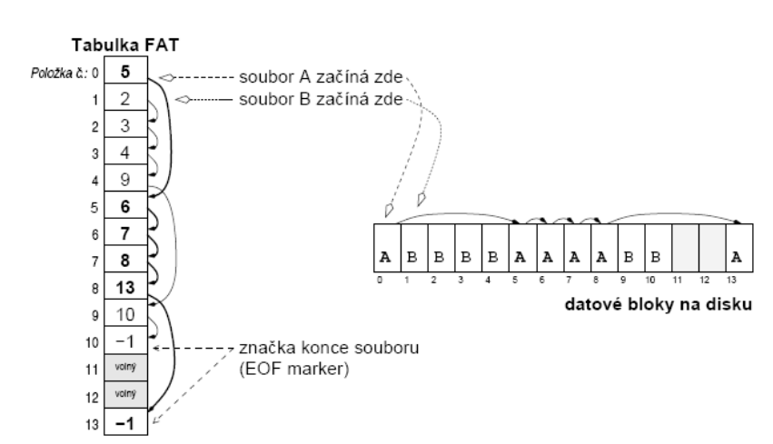

- položce číslo X ve FAT odpovídá datový blok X na disku
- položka ve FAT obsahuje odkaz na další datový blok na disku a tedy i na další položku ve FAT  tabulce
- výhoda
    - pokud bych chtěl např. k souboru B přidat další datový blok, nemusím s ničím hýbat
    - pouze do FAT(10) vložím číslo 11 a do FAT(11) dám `-1` a soubor B je prodloužený
    - tedy že při manipulaci s určitým souborem neovlivňujeme pozici ostatních souborů na disku
- defragmentace
    - **úplná** 
        - obsazené bloky souborů půjdou na disku za sebou, poté následuje volné místo
    - **částečná** 
        - upraví se jen tak, že napřed je obsazený prostor soubory a za ním volné bloky

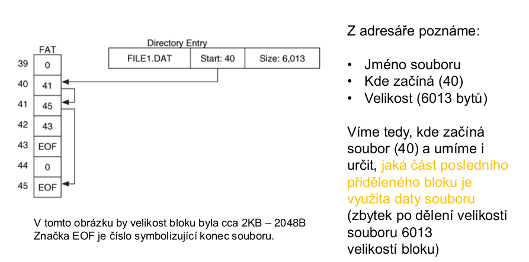
- nevýhodou je velikost tabulky FAT
    - 80GB disk, bloky 4KB => 20 mil. položek
    - každá položka alespoň 3 byty => 60MB FAT
    - výkonnostní důsledky (část FAT chceme v cache v RAM)
- **u souborů není žádná informace o přístupových právech**

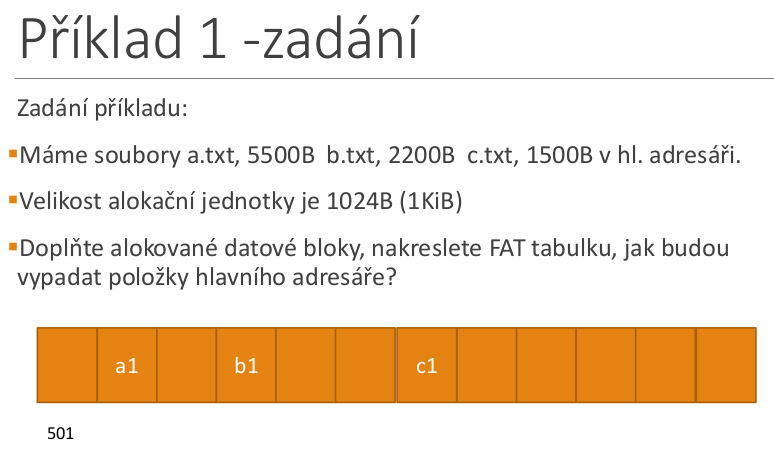

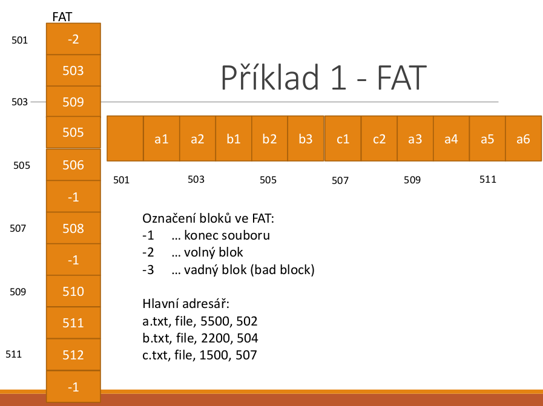

### NTFS
- nativní souborový systém Windows
- žurnálování
    - zápisy na disk se zapisují do žurnálu, pokud uprostřed zápisu systém havaruje, je možné dle stavu žurnálu zápis dokončit nebo anulovat => konzistentní stav
    - access control list
        - přidělování práv k souborům
    - komprese
        - na úrovni FS lze soubor nastavit jako komprimovaný
    - šifrování
        - EFS (encrypting file system)
    - diskové kvóty
        - max. velikost pro uživatele na daném oddíle, dle reálné velikosti
    - pevné a symbolické linky
- struktura
    - 64 bitové adresy clusterů
    - clustery číslovány od začátku paritice - logická čísla clusterů
    - systém jako obří databáze
        - záznam v ní odpovídá souboru
    - základ 11 systémových souborů
        - metadata
        - vzniknou hned při formátování svazku
    - **MFT**
        - **nejdůležitější!!!**
        - záznamy o všech souborech, adresářích, metadatech
        - hned za boot sektorem, za ním se udržuje zóna volného místa
    - defaultní velikosti clusterů:

        |Volume size|NTFS cluster size|
        |---|---|
        |7MB-512MB|512B|
        |513MB-1024MB|1KB|
        |1025MB-2GB|2KB|
        |2GB-2TB|4KB|
- adresáře
    - speciální soubory
    - B-stromy se jmény souborů a odkazy na záznamy v MFT
- zkopírováním souboru z NTFS na FAT => ztratíme přístupová práva a alternativní datové proudy
- způsob uložení data
    - kódování delkou běhu
    - od pozice **100** máme např. uloženo:
        - A1, A2, A3, B1, B2, A4, A5, C1
    - soubor A bude popsaný fragmenty
    - fragment
        - index
        - počet bloků daného fragmentu
    - v našem příkladě pro soubor A a dva fragmenty:
        - 1. 100, 3 (od indexu 100 patří tři bloky souboru A)
        - 2. 105, 2 (od indexu 105 patří dva bloky souboru A)

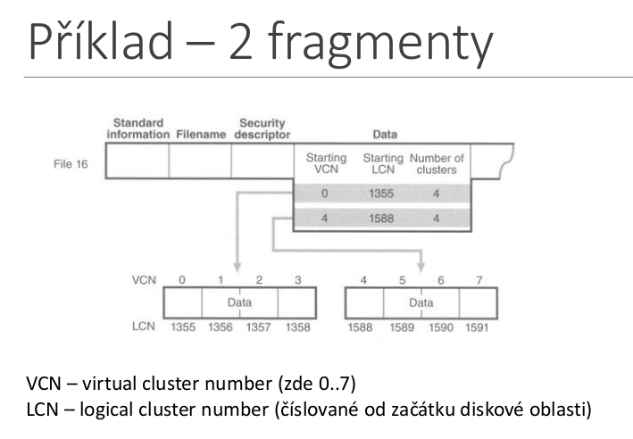

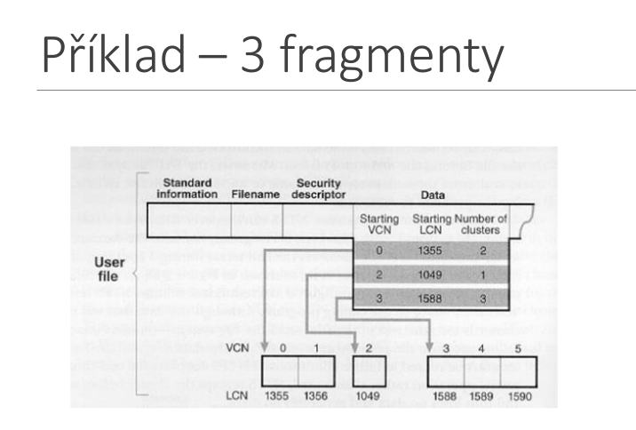

- ideální případ
    - **1 soubor = 1 fragment**
    - výhody kontinuální alokace
- defragmentovat můžeme jak celou partici, tak jen vybrané soubory
- **NTFS - Sparse Files**
    - soubor 17GB
        - užitečná data 7GB
        - nuly 10GB
        - na disku zabere místo 17GB
        - u sparse file jen 7GB

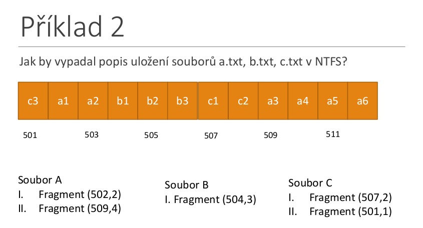

### Systémy využívající i-uzlů
- každý soubor (a  tedy i adresář) je reprezentovaný i-uzlem
- i-uzel (datová struktura)
    - **metadata** popisující:
        - vlastníka souboru
        - přístupová práva
        - velikost souboru
        - **není zde název souboru**
    - **umístění bloků na souboru disku**
        - přímé odkazy a nepříme 1., 2. a 3. úrovně
        - abychom věděli, jaké bloky přistupovat
- adresář systému s i-uzly
    - soubor obsahující dvojici:
        - **název souboru** a **číslo odpovídajícího i-uzlu**

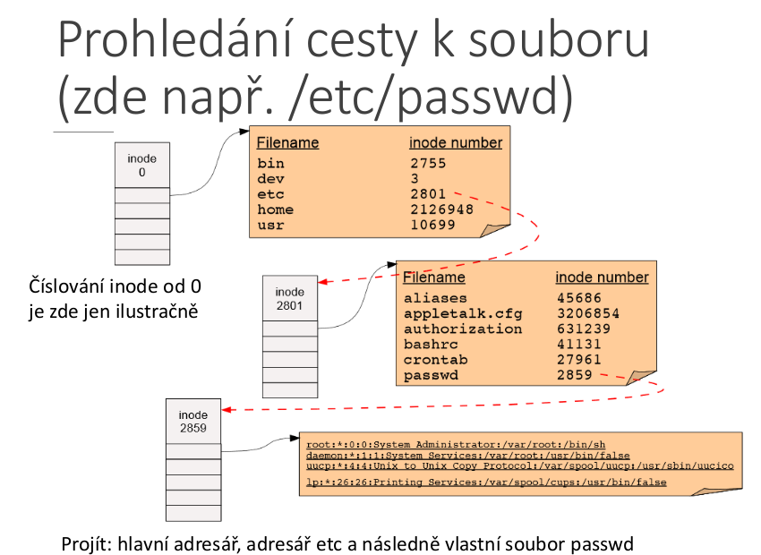

- 1 i-uzel = 1 soubor
- pevný počet i-uzlů = max. počet souborů na daném oddílu disku
- pokud nám dojdou i-uzly, další soubor již nemůžeme vytvořit, ale pokud zbývají datové bloky, můžeme prodloužit stávající soubory
- **superblock** obsahuje důležité informace
    - příznak čistoty
    - verze
    - počet i-nodů
    - velikost alokační jednotky
    - seznam volných bloků

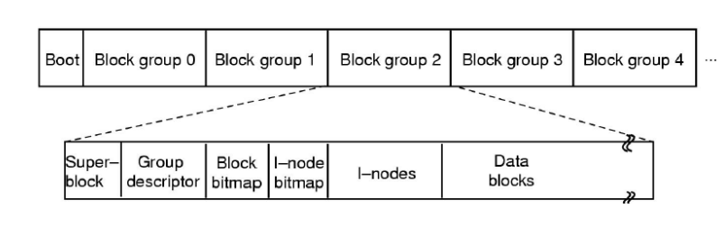

- vlastnosti
    - klíčové informace jsou násobně duplikovány, např. superblock
    - bitmapa i-nodů říká, který i-node je volný
    - bitmapa datových bloků říká, který datový blok je volný
    - i-nody a odpovídající data jksou blízko u sebe
    - chci vytvořit nový soubor
        - v bitmapě najdu volný i-node
        - dále hledám v bitmapě datových bloků volné bloky pro data
- i-uzel obsahuje:
    - atributy souboru:
        - velikost souboru
        - počet odkazů na soubor
        - práva a pro koho jsou, časy vytvoření, modifikace
    - diskové adresny prvních N bloků souboru
    - více odkazů na diskové bloky obsahující další diskové adresy (případně obsahující odkazy na bloky obsahující adresy) - 1., 2., 3. nepřímé úrovně
- tradiční pro Unix
    - používá se `ext4` (2, 3)
- odkazy:
    - typicky 10-12 přímých odkazů na bloky obsahující seznam odkazů na data
    - 1. nepřímý
        - odkaz na datový blok obsahující seznam odkazů na data
    - 2. nepřímý
    - 3. nepřímý
- nepřímé odkazy:
    - datový blok, místo toho, aby obsahoval data souboru, tak obsahuje odkazy na další datové bloky využité souborem
    - datový blok tedy obsahuje **metadata** (zde ukazatele), místo dat souboru
- mohou být 1., 2. a 3. úrovně
    - odkaz na blok z i-nodu -> data souboru (přímé odkazy)
    - odkaz na blok z i-nodu -> metadata -> data souboru **(1.úroveň)**
    - odkaz na blok z i-nodu -> metadata -> metadata -> data souboru **(2.úroveň)**
    - odkaz na blok z i-nodu -> metadata -> metadata -> metadata -> data souboru **(3.úroveň)**

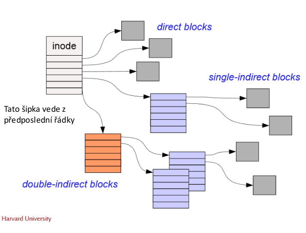

- malé soubory
    - přímé odkazy na datové bloky (rychlý přístup k ním)
- velké soubory 
    - využívají i nepřímé odkazy
- i-uzel má pevnou velikost
    - stejnou pro velký i malý soubor
- výhoda i-uzlů
    - po otevření souboru můžeme **zavést i-uzel** a případ ný blok obsahující další adresy **do paměti**, čímž urychlíme přístup k souboru

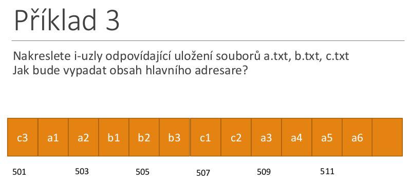
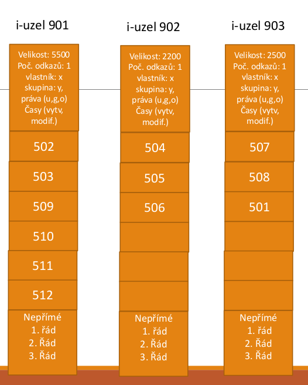
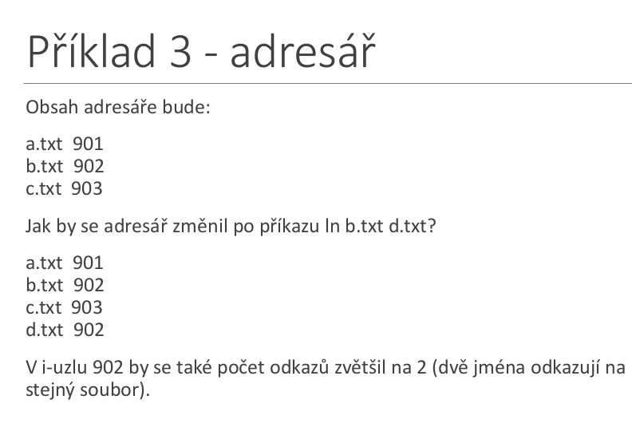
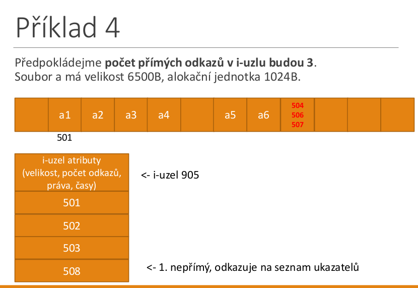

- adresáře
    - **často implementovány speciálním typem souboru**
        
