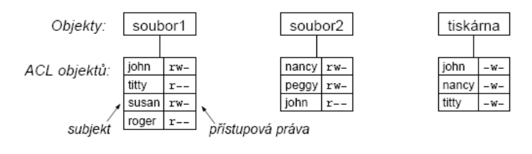

# 30. Kontrola konzistence souborového systému, mechanismy ochrany před neoprávněným přístupem
- ztráta dat má často horší důsledky než zničení počítače
    - diplomová/bakalářská práce
    - fotografie za posledních 10
- FS musí být jedna z nejspolehlivějších částí OS, snaha chránit data
    - správa vadných bloků (hlavně dříve)
    - rozprostřít a duplikovat důležité datové struktury, čitelnost i po částečném poškození povrchu
- konzinstence FS
    - **blokové zařízení**
        - OS přečte blok souboru, změní ho, zapíše
    - **nekonzistentní stav**
        - může nastat při havárii (např. výpadek napájení) předtím, než jsou všechny modifikované bloky zapsány
## Kontrola konzistence souborového systému
- konzistence informace o diskových blocích souborů
    - blok (obvykle) patří jednomu souboru nebo je volný
- konzistence adresářové struktury
    - jsou všechny adresáře a soubory dostupné?
- rozdíl:
    - kontrola konzistence souboru 
    - kontrola, zda je soubor dostupný z nějakého adresáře

### Konzistence informace o diskových blocích souborů
- tabulka počtu výskytů bloku v souboru
- tabulka počtu výskytů bloku v seznamu volných bloků
- položky obou tabulek inicializovány na 0
- procházíme informace o souborech (např. i-uzly), inkrementujeme položky odpovídající blokům souboru v první tabulce
- procházíme seznam nebo bitmapu volných bloků a inkrementujeme příslušené položky ve druhé tabulce

- **konzistentní FS**

    |Číslo bloku|0|1|2|3|4|5|6|7|8|
    |---|---|---|---|---|---|---|---|---|---|
    |Výskyt v souborech|1|0|1|0|1|0|2|0|1|
    |Volné bloky|0|1|0|0|1|2|0|1|0|
    - blok je buď volný, nebo patří nějakému souboru, tj. konzistentní hodnoty v daném sloupci jsou buď `(0,1)` nebo `(1,0)`
        - vše ostatní jsou chyby
    - chyby:
        - `(0,0)` - blok se nevyskytuje v žádné tabulce
            - _missing block_
            - není závažné, pouze redukuje kapacitu FS
            - oprava: vložení do seznamu volných bloků
        - `(0,2)` - blok je dvakrát nebo vícekrát vseznamu volných
            - problém - blok by mohl být alokován víckrát
            - opravíme seznam volných bloků, aby se vyskytoval pouze jednou
        - `(1,1)` - blok patří souboru a zároveň je na seznamu volných
            - problém, blok b mohl být alokován podruhé
            - oprava: blok vyjmeme ze seznamu volných bloků
        - `(2,0)` - blok patří do dvou nebo více souborů
            - nejzávažnější problém, nejspíš už došlo ke ztrátě dat
            - snaha o opravu: alokujeme nový blok, problematický blok do něj zkopírujeme a upravíme i-uzel druhého souboru
            - uživatel by měl být informován o problému
### Kontrola konzistence adresářové struktury
- tabulka čítačů, jedna položka pro každý soubor
- program prochází rekurzivně celý adresářový strom
- položku pro soubor program zvýší pro každý výskyt souboru v adresáři
- zkontroluje, zda odpovídá počet odkazů v i-uzlu (`i`) s počtem výskytů v adresářích (`a`)
    - `i == a` pro každý soubor => konzistentní 
- možné chybny:
    - `i > a`
        - **soubor by nebyl zrušen ani po zrušení**
    - `i < a`
        - **soubor by byl zrušen po zrušení i odkazů, ale v adresářích budou ještě jména**
        - velký problém - adresáře by ukazovaly na neexistující soubory
        - řešíme nastavením počtu odkazů na správnou hodnotu
    - `a=0, i>0`
        - **ztracený soubor, na který není v adresáři odkaz**
        - ve většině systémů program soubor zviditelní na předem určeném místě (např. adresář `lost+found`)
- další heuristické kontroly
    - odpovídají jména souborů konvencím OS?
        - když ne, soubor může být nepřístupný, změníme jméno
    - nejsou přístupová práva nesmyslná?
        - např. vlastník nemá přístup k souboru
    - jen obecné kontroly FS

### Journaling FS
- kontrola konzistence je časově náročná, proto žurnálování
- postup:
    - před každým zápisem na disk vytvoří na disku záznam popisující plánované operace, pak provede operace a záznam zruší
    - výpadek => na disku najdeme žurnál o všech operacích, které mohly být v době havárie rozpracované, zjednodušuje kontrolu konzistence FS
- např. **ext3** a **ext4**
- detailní popis:
    1. zapíši do žurnálu
    2. když je žurnál kompletní, zapíšeme značku `JOURNAL_COMPLETE`
    3. začneme psát datové bloky
    4. je-li hotovo, smažeme žurnál
- **ošetření výpadku**
    - dojde-li k výpadku elektřiny -> nebyl koretkně odmontovaný oddíl se souborovým systémem -> pozná
    - podívá se do žurnálu:
        - a) je prázdný -> není třeba nic dělat
        - b) je tam nějaký zápis, ale není značka `JOURNAL_COMPLETE` -> jen smažeme žurnál
        - c) v žurnálu je zápis včetně značky `JOURNAL_COMPLETE` -> přepíšeme obsah žurnálu do datových bloků
- co žurnálovat?
    - všechny zápisy, tj. i do souborů
        - zapisují se metadata i data
        - pomalejší
    - zápisy metadat
        - rychlejší
        - může dojít ke ztrátě obsahu souboru, ale nerozpadne se struktura adresářů

## Mechanismy ochrany před neoprávněným přístupem
- cílem je chránit soubor před neoprávněným přístupem
- chránit i další objetky
    - HW (segmenty paměti, I/O zařízení)
    - SW (procesy, semafory, ...)
- **subjekt** - entita schopná přistupovat k objektům (většinou proces)
- **objekt** - cokoliv k čemu je potřeba omezovat přístup pomocí přístupových práv (např. soubor)
- systém uchovává informace o přístupových právech subjektů k objektům
- **ACL** - s objektem je sdružen seznam subjektů a jejich přístupových práv
- **capability list** - se subjektem je sdružen seznam objektů a přístupových práv k nim
### ACL
- s objektem je sdružen seznam subjektů, které mohou k objektu přistupovat
- pro každý uvedený subjekt je v ACL množina přístupových práv k objektu

- sdružování subjektů do tříd nebo skupin
    - studenti
    - zaměstnanci
- skupiny mohou být uvedeny na místě subjektu v ACL
- zjednodušuje administraci
    - nemusíme uvádět všechny studenty jmenovitě
- ACL používá mnoho moderních FS (ntfs, xfs, ...)
- např v NTFS:
    - se souborem je spojena následující tabulka, která určuje, kdo smí co s daným souborem děla. 
    - počet řádek tabulky záleží na tom, pro kolik skupin uživatelů budeme práva nastavovat
    - klasická unixová práva (u, g, o) jsou příliš limitovaná - když chceme více skupin, více uživatelů atd. potřebujeme ACL

        |Uživatel/skupina|ID|práva|
        |---|---|---|
        |0|505 (Pepa)|`rw`|
        |1|101 (Studenti)|`r`|
        |1|102 (Zaměstnanci)|`rw`|

### Klasická unixová práva
- `chmod 777 s1.txt`
    - práva pro vlastníka (`u`)
    - práva pro skupinu (`g`)
    - práva pro ostatní (`o`)
    - typ práv: `r`, `w`, `x` (`s`, `t`)
        - `t` => sticky bit
            - pokud na složce, tak definuje, že pouze ten, kdo vytvoří soubor, ho může smazat
        - `s` => spuštěn buď pod uživatelem nebo pod skupinou
- oproti ACL jsou omezující
    - chceme pro více skupin různá nastavení
    - chceme pro více uživatelů různá nastavení
- _klasická unixová práva `u,g,o` nejsou považována za ACL, naopak systémy, které je využívají se o ACL rozšiřují_
- ACL má přednost před klasickými unixovými právy
    - tj. nastavením `chmod 777` nezrušíme ACL

### Doimplementování ACL do i-uzlu
- v i-uzlu by byla **část tabulky ACL**, pokud by se nevešla celá do i-uzlu, tak **odkaz na diskový blok** obsahující zbytek **ACL**
- každá položka ACL
    - subjekt: ID uživatele či ID skupiny + 1 bit rozlišení uživatel/skupina
    - přístupové právo n-bitovým slovem
        - 1 - právo přiděleno
        - 0 - právo odejmuto
- Linux: 
    - `tune2fs - acl /dev/sda`
    - `setfacl -m "u:johny"rwx" abc`
        - nastaví práva pro uživatele `johny` na soubor `abc`
    - `getfacl abc`
    - příkaz `ls`
        - pokud je u práv znak `+` tak **používá ACL**

### Mechanismus capability lists (C-seznamy)
- s každým subjektem (procesem) sdružen seznam objektů, kterým může přistupovat a jakým způsobem (tj. přístupová práva)
- seznam se nazývá capability list (C-list)
- jednotlivé položky -> **capabilities**
- struktura:
    - **typ objektu**
    - **práva** obvykle bitová mapa popisující dovolené operace nad objektem
    - **odkaz na objekt**, např. číslo uzlu, segmentu, atd...
- problém - zjištění, kdo všechno má k objektu přístup
- **zrušení přístupu velmi obtížné**
    - najít pro objekt všechny capability + odejmout práva
    - řešení:
        - odkaz neukazuje na objekt, ale na nepřímý objekt
        - systém může zrušit nepřímý objekt, tím zneplatní odkazy na objekt ze všech C-seznamů
- **capability list**
    - pokud jsou jediný způsob odkazu na objekt (bezpěčný ukazatel, capability-based addressing):
        - ruší rozdíl mezi objekty na disku, vpaměti, nebo na jiném stroji
        - mechanismus C-seznamů v některých distribuovaných systémech (Hydra, Mach,...)

### Přehled přístupových práv
- FAT - **žádná**
    - jen atributy typu `read-only`, `archive`
- ext2
    - klasická unixová práva (není to ACL)
    - vlastník, skupina, ostatní (r, w, x, s, ...)
    - lze přidat ACL
- NTFS
    - ACL
    - lze měnit přes grafické UI, příkaz `icacls`
    - explicitně udělit/odepřítp ráva
    - zdědit práva, zakázat dědění
